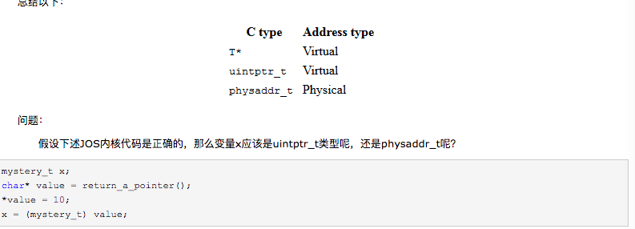
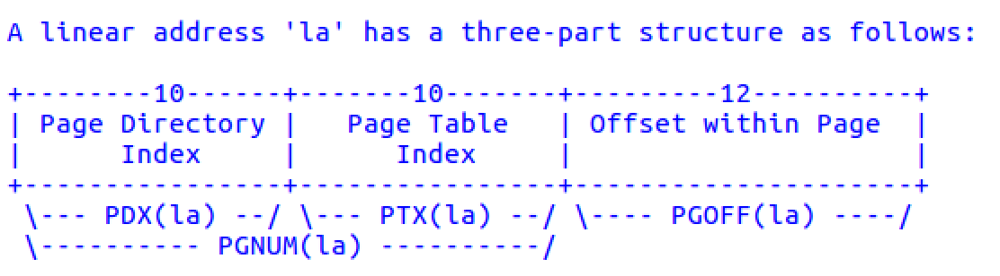
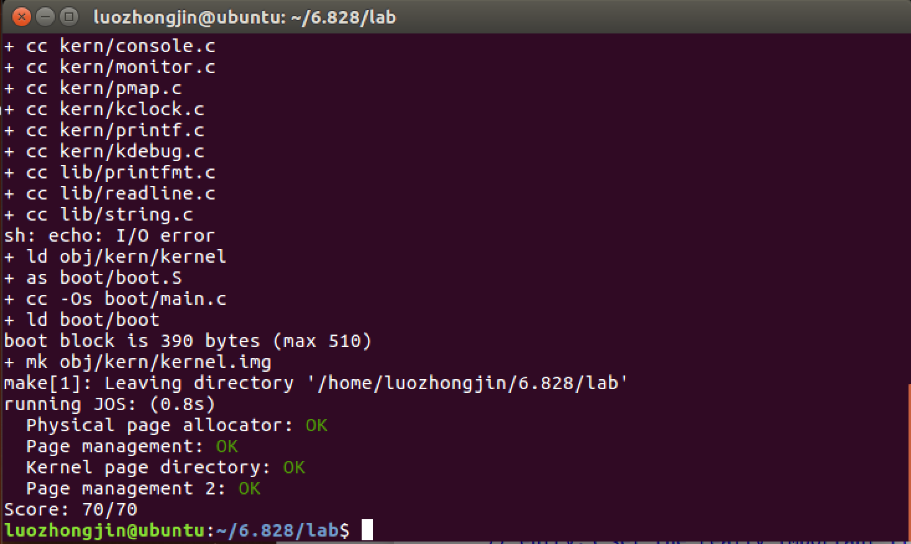

lab2是内存管理相关，分为两个部分，第一部分为物理内存管理，第二部分为虚拟内存管理。

## Part 1：Physical Page Management(物理页面管理)

在完成Exercise 1之前，要明白一下几个概念

- 访问权限

  ```
  #define PTE_P		0x001	// Present
  #define PTE_W		0x002	// Writeable
  #define PTE_U		0x004	// User
  #define PTE_PWT		0x008	// Write-Through
  #define PTE_PCD		0x010	// Cache-Disable
  #define PTE_A		0x020	// Accessed
  #define PTE_D		0x040	// Dirty
  #define PTE_PS		0x080	// Page Size
  #define PTE_G		0x100	// Global
  ```


- JOS使用PageInfo数据结构来表示一个物理页面，pages数组表示所有的物理页面，pages数组的每一项对应一个物理页面。pages_free_list是空闲页链表头（指向第一个空页，然后由pp_link指向下一个空页）

  ```
  struct PageInfo {
  	// Next page on the free list.
  	struct PageInfo *pp_link;

  	// pp_ref is the count of pointers (usually in page table entries)
  	// to this page, for pages allocated using page_alloc.
  	// Pages allocated at boot time using pmap.c's
  	// boot_alloc do not have valid reference count fields.

  	uint16_t pp_ref;
  };
  ```

  - pp_link：指向下一个空闲页（当前页面为空页时才有效）
  - pp_ref：每一个物理页上存在着多少不同的虚拟地址来引用它，这个值存放在这个物理页的PageInfo结构体的pp_ref成员变量中。当这个值变为0时，这个物理页才可以被释放。通常来说，任意一个物理页p的pp_ref值等于它在所有的页表项中，被位于虚拟地址UTOP之下的虚拟页所映射的次数（UTOP之上的地址范围在启动的时候已经被映射完成了，之后不会被改动）


- jos把整个物理内存空间划分成三个部分：
  - 一个是从0x00000~0xA0000，这部分也叫basemem，是可用的。
  - 紧接着是0xA0000~0x100000，这部分叫做IO hole，是不可用的，主要被用来分配给外部设备了。
  - 再紧接着就是0x100000~0x，这部分叫做extmem，是可用的，这是最重要的内存区域。
- kern_pgdir — 指向操作系统的页目录表的指针
- 为了能够帮助我们记录代码，JOS源文件中的地址被区分为两种情况
  - uintptr_t -- 表示虚拟地址
  - physaddr_t -- 表示物理地址
- 一些重要的函数
  - PADDR(va)  : va - KERNBASE
  - KADDR(pa) : pa + KERNBASE
  - ROUNDUP() : 页对齐
  - page2kva(pp)：KADDR(page2pa(pp))
  - pa2page(pa)：&pages[PGNUM(pa)]
  - page2pa(pp)：(pp - pages) << PGSHIFT

Exercise 1:

观察 ``kern/pmap.c`` ，根据注释可知，mem_init()函数是内存管理的入口，其作用是初始化内核部分的地址空间，如设置页表等。

- 首先被调用的是boot_alloc()，根据注释可知，这个函数只是在page_free_list初始化前会被使用的内存分配器，后面使用的是 page_alloc()。**主要用户映射UTOP以上的空间**

  ```
  //暂时用作页分配器，真实的物理页分配器是page_alloc函数
  static void *
  boot_alloc(uint32_t n)
  {
  	static char *nextfree;	// 指向下一个空闲内存单元
  	char *result;
  	//nextfree为静态变量，初始时指向开始指向内核bss段的末尾
  	/*根据mem_init()函数可知，kern_pgdir初始化时第一次调用boot_alloc(),
  	  故kern_pgdir指向end*/
  	if (!nextfree) {
  		extern char end[];
  		//end 在哪里？？？
  		nextfree = ROUNDUP((char *) end, PGSIZE);
  	}
  	result = nextfree;
  	//ROUNDUP()用作页对齐
  	nextfree = ROUNDUP((char *)nextfree + n, PGSIZE);
  	return result;
  }
  ```

- 下一步要分配一块内存，存放pages数组，pages数组的每一项表示一个物理页

  ```
  n = npages * sizeof(struct PageInfo);
  pages = (struct PageInfo *) boot_alloc(n);
  //内存清零
  memset(pages, 0, n);
  ```

- 下一步要初始化pages数组和空闲页链表page_free_list，即完成page_init()

  - 初始化pages数组 
  - 初始化pages_free_list链表

  ```
  //初始化时要注意，根据注释，有些页面是已经被占用
  //？？？？这些被占用的页面是怎么计算的
  void
  page_init(void)
  {
  	size_t i;
  	size_t pgnum = PGNUM(PADDR(boot_alloc(0)));
  	for (i = 1; i < npages; i++) {
  		if (i >= npages_basemem && i < pgnum)
  			continue;
  		pages[i].pp_ref = 0;
  		pages[i].pp_link = page_free_list;
  		page_free_list = &pages[i];
  	}
  }
  ```

- 下一步要完成page_alloc()函数，其作用是分配一个物理页面

  -  从free_page_list中取出一个空闲页的PageInfo结构体
  -  修改free_page_list相关信息
  -  修改取出的空闲页的PageInfo结构体信息，初始化该页的内存

  ```
  struct PageInfo *
  page_alloc(int alloc_flags)
  {
  	// Fill this function in
  	struct PageInfo *result = NULL;
  	//如果存在空闲页
  	if (page_free_list) {
  		result = page_free_list;
  		page_free_list = page_free_list->pp_link;
  		result->pp_link = NULL;
  		//??????
  		if (alloc_flags & ALLOC_ZERO)
  			memset(page2kva(result), 0, PGSIZE);
  	}
  	return result;
  }
  ```

- 有了页分配器当然要有页释放器 — page_free()

  - 修改被回收的页的PageInfo结构体的相应信息。
  - 把该结构体插入回page_free_list空闲页链表

  ```
  void
  page_free(struct PageInfo *pp)
  {
  	// Fill this function in
  	// Hint: You may want to panic if pp->pp_ref is nonzero or
  	// pp->pp_link is not NULL.
  	//容错判断
  	assert(pp != NULL);
  	assert(pp->pp_ref == 0);
  	assert(pp->pp_link == NULL);
  	
  	//释放物理页面
      pp->pp_link = page_free_list;
      page_free_list = pp;
  }
  ```


##Part 2: Virtual Memory — 物理地址和物理地址的映射，即页表的操作

在完成Exercise 4之前，要明白一下几个概念

- 线性地址组成

  

  有上面可知，只要给出虚拟地址（线性地址）和 页目录指针，即可解析出页表项

- pde_t：代表一个页目录项  

  pte_t：代表一个页表项

  PDX：页目录索引

  PTX：页表项索引

  PGOFF：偏移量

  PGNUM：pages数组索引

  PTE_ADDR：？？？？

  pgdir_walk()  用于查找某个虚拟地址是否有页表项，如果没有也可以通过此函数创建，值得注意的是，有页表项并不代表已经被映射。(根据虚拟地址返回页表项指针)

  boot_map_region()  映射一个虚拟地址区间到一个物理地址区间。

  page_insert() 将一个虚拟地址映射到一个Page数据结构，也就是映射到某个物理地址(就是更新页表)

  page_lookup() 查找一个虚拟地址对应的Page数据结构，若没有映射返回空。(返回一个物理页)

  page_remove() 解除某个虚拟地址的映射。(也是更新页表)

  **UTOP以上用boot_map_region映射，以下用page_alloc和page_insert**

- 在JOS中，整个虚拟地址空间被分成了一下几个重要的部分：

  1.从 虚拟地址UTOP(0xeec00000)开始，到 ULIM(0xef800000),这一段中间的地址对于用户进程来说，是一段只读进程，用户进程可以访问，但是不能写。

  2.在UTOP以下的空间，是用户空间，用户可以访问，可写可读可执行。

  3.在ULIM以上的空间，是内核空间，用户不可访问。

  其中，用户栈初始位置是在 USTACKTOP (0xeebfe000), 内核栈的初始位置为:KSTACKTOP(0xf0000000)，而内核栈的初始地址被保存在一个名为TSS的数据就够中，其里面有esp0来存储内核栈的初始位置，即KSTACKTOP(0xf0000000)。

Exercise 4：

- 首先是 pgdir_walk ()，其作用是根据虚拟地址返回对应的页表项指针

  ```c
  pte_t *
  pgdir_walk(pde_t *pgdir, const void *va, int create)
  {
  	//根据虚拟地址解析出页目录索引和页表索引，pdx--页目录索引 ptx -- 页表索引
  	size_t pdx = PDX(va), ptx = PTX(va);
  	struct PageInfo *pp = NULL;
  	pte_t *pgtbl = NULL;

  	if (!(pgdir[pdx] & PTE_P)) {
  		if (!create) 
  			return NULL;
  		pp = page_alloc(ALLOC_ZERO);
  		if (pp == NULL) 
  			return NULL;
  		pp->pp_ref++;
  		pgdir[pdx] = page2pa(pp) | PTE_W | PTE_U | PTE_P; 
  	} 

  	pgtbl = (pte_t *) KADDR(PTE_ADDR(pgdir[pdx]));
  	return &pgtbl[ptx];
  }
  ```

- 下一步是完成boot_map_region函数，其作用是把虚拟地址空间范围[va, va+size)映射到物理空间[pa, pa+size)的映射关系加入到页表中

  ```
  static void
  boot_map_region(pde_t *pgdir, uintptr_t va, size_t size, physaddr_t pa, int perm)
  {
  	size_t i;
  	for (i = 0; i < size; i += PGSIZE) {
  		pte_t *pte = pgdir_walk(pgdir, (void *)(va + i), 1);
  		*pte = (pa + i) | perm | PTE_P;
  	}
  }
  ```

- 下一步是完成page_insert()，其作用是把一个物理内存中页与虚拟地址va建立映射关系，其实就是更新页表

  ```
  int
  page_insert(pde_t *pgdir, struct PageInfo *pp, void *va, int perm)
  {
  	pte_t *pte = pgdir_walk(pgdir, va, 1);
      if (pte == NULL)  
      	return -E_NO_MEM;
      pp->pp_ref++;
      
      if (*pte & PTE_P)
              page_remove(pgdir, va);
      //做映射 -- 更新页表项
      *pte = page2pa(pp) | perm | PTE_P;
      return 0;
  }
  ```

- 下一步是完成page_lookup函数，起作用是返回虚拟地址所对应的物理页的PageInfo结构体的指针

  ```
  struct PageInfo *
  page_lookup(pde_t *pgdir, void *va, pte_t **pte_store)
  {
  	// Fill this function in
  	pte_t *pte = pgdir_walk(pgdir, va, 1);
  	/*pte_store存页表项指针的地址，*pte_store表示页表项指针，
  	  即页表项地址，**pte_store表示页表项,pte_store是为了改变页表项指针的指向，
  	  从而实现在函数外改变页表项内容*/
  	if (pte_store)
  		*pte_store = pte;
  	if (pte == NULL || !(*pte & PTE_P)) 
  		return NULL;
  	//这里为什么要用 PTE_ADDR？？？
  	return pa2page(PTE_ADDR(*pte));
  }
  ```

- 下一步是完成page_remove函数，功能是把虚拟地址va和物理页的映射关系删除，也就是更新页表

  ```
  void
  page_remove(pde_t *pgdir, void *va)
  {
  	pte_t *pte = NULL;
  	struct PageInfo *pp = page_lookup(pgdir, va, &pte);
  	if(pp == NULL)
  		return;
  	*pte = (pte_t) 0; //将页表项内容置为空
  	tlb_invalidate(pgdir, va); //tlb置为无效
  	page_decref(pp); //减少引用
  }
  ```


## Part 3 Kernel Address Space

JOS把32位线性地址虚拟空间划分成两个部分。其中用户环境（进程运行环境）通常占据低地址的那部分，叫用户地址空间。而操作系统内核总是占据高地址的部分，叫内核地址空间。处在用户地址空间中的代码不能访问高于ULIM的地址空间，但是内核可以读写这部分空间。而内核和用户对于地址范围[UTOP, ULIM]有着相同的访问权限，那就是可以读取但是不可以写入。这一个部分的地址空间通常被用于把一些只读的内核数据结构暴露给用户地址空间的代码。在UTOP之下的地址范围是给用户进程使用的，用户进程可以访问，修改这部分地址空间的内容。

lab2的第三部分其实就是做一些地址映射，处理虚拟地址和物理地址的映射关系

- 把pages数组映射到线性地址UPAGES，大小为一个PTSIZE

  ```
  boot_map_region(kern_pgdir, UPAGES, PTSIZE, PADDR(pages), PTE_U);
  ```

- 下一步是映射内核的堆栈区域，把由bootstack变量所标记的物理地址范围映射给内核的堆栈，内核堆栈的虚拟地址范围是[KSTACKTOP-PTSIZE, KSTACKTOP)，不过要把这个范围划分成两部分：

  - [KSTACKTOP-KSTKSIZE, KSTACKTOP) 这部分映射关系加入的页表中。
  - [KSTACKTOP-PTSIZE, KSTACKTOP-KSTKSIZE) 这部分不进行映射。

  ```
  boot_map_region(kern_pgdir, KSTACKTOP - KSTKSIZE, KSTKSIZE, PADDR(bootstack), PTE_W | PTE_P);
  ```

- 下一步是将整个物理内存映射到虚拟地址空间KERNBASE，虚拟地址范围是[KERNBASE, 2^32]，物理地址范围是[0，2^32 - KERNBASE]。（也就是映射整个操作系统内核？？）

  ```
  //2^32 - 15*16^7 = 1*16^7 = 0x10000000
  boot_map_region(kern_pgdir, KERNBASE, 0x10000000, 0, PTE_W | PTE_P);
  ```

- 到目前为止页目录表中已经包含多少有效页目录项？他们都映射到哪里？

  - 3BD号页目录项，指向的是kern_pgdir
  - 3BC号页目录项，指向的是pages数组
  - 3BF号页目录项，指向的是bootstack
  - 3C0~3FF号页目录项，指向的是kernel

- 这个操作系统的可以支持的最大数量的物理内存是多大？

  由于这个操作系统利用一个大小为4MB的空间UPAGES来存放所有的页的PageInfo结构体信息，每个结构体的大小为8B，所以一共可以存放512K个PageInfo结构体，所以一共可以出现512K个物理页，每个物理页大小为4KB，自然总的物理内存占2GB。

- 如果现在的物理内存页达到最大个数，那么管理这些内存所需要的额外空间开销有多少？

  这里不太明白，参考别的答案是，首先需要存放所有的PageInfo，需要4MB，需要存放页目录表，kern_pgdir，4KB，还需要存放当前的页表，大小为2MB。所以总的开销就是6MB + 4KB。




