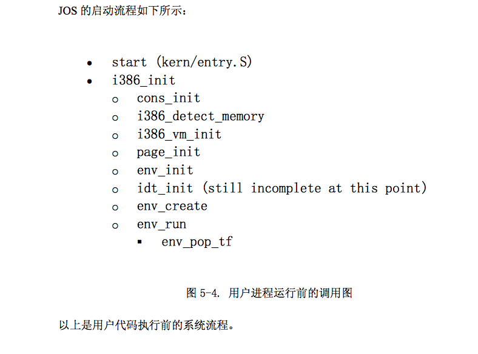
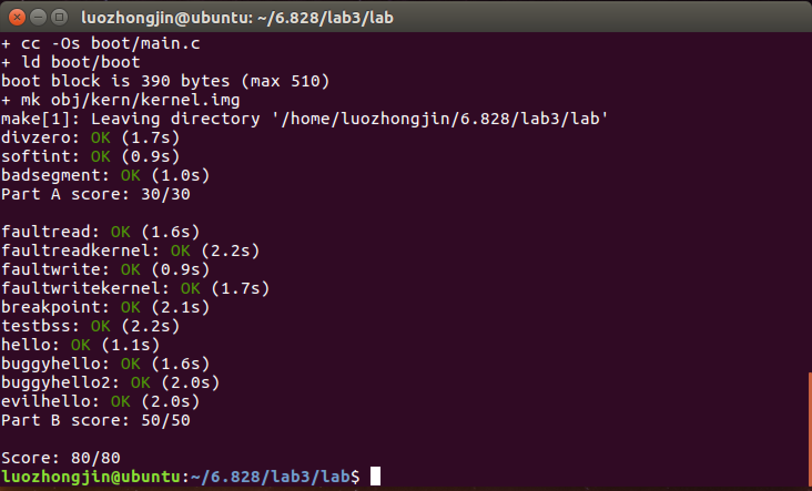

lab3大体分为两部分，第一部分包括执行环境的建立和运行第一个进程，第二个部分初始化并完成中断和异常以及系统调用相关机制。

##Part A: User Environments and Exception Handling

在完成相关exercise前，需要了解一些相关概念

- 用户环境：一个应用程序在系统中所需要的一个上下文环境

- 操作系统内核使用数据结构 Env 来记录每一个用户环境的信息

  - 即一个 Env 对应一个进程

  - Env结构体

    ```
    struct Env {

    	struct Trapframe env_tf;      //saved registers

    　　 struct Env * env_link;         //next free Env

    	envid_t env_id;　　            //Unique environment identifier

    	envid_t env_parent_id;        //envid of this env's parent

    	enum EnvType env_type;　　//Indicates special system environment

    	unsigned env_status;　　   //Status of the environment

    	uint32_t env_runs;         //Number of the times environment has run

    	pde_t *env_pgdir;　　　　//Kernel virtual address of page dir.

    };
    ```

    - env_tf : 寄存器信息
    - env_link：指向后一个空闲的Env结构体
    - env_id：唯一的确定使用这个结构体的用户环境是什么
    - env_parent_id：创建这个用户环境的父用户环境的env_id
    - env_type：用于区别出来某个特定的用户环境。对于大多数环境来说，它的值都是 ENV_TYPE_USER.
    - env_runs：进程的运行时间还是次数？？？
    - env_status：枚举数
      - ENV_FREE: 代表这个结构体是不活跃的，应该在链表env_free_list中。
      - ENV_RUNNABLE: 代表这个结构体对应的用户环境已经就绪，等待被分配处理机。
      - ENV_RUNNING: 代表这个结构体对应的用户环境正在运行。
      - ENV_NOT_RUNNABLE: 代表这个结构体所代表的是一个活跃的用户环境，但是它不能被调度运行，因为它在等待其他环境传递给它的消息。
      - ENV_DYING: 代表这个结构体对应的是一个僵尸环境。一个僵尸环境在下一次陷入内核时会被释放回收。
    - env_pgdir：这个变量存放着这个环境的页目录的虚拟地址

- 在JOS中，每个进程都有4GB的虚拟地址空间，其中的内核部分都是相同的。

- 在JOS中，每个进程都有代码段、数据段、用户栈、进程属性，由于当前系统还没有文件系统，系统将用户进程编译链接成原始的ELF二进制映像内嵌到内核中，所以系统加 载一个用户进程对应的代码和数据时读取的对象是ELF格式文件

- 在 kern/env.c 文件中我们看到，操作系统一共维护了三个重要的和用户环境相关的全局变量：

  - struct Env *envs = NULL;    //表示系统中所有的用户环境的env。在我们的设计中，JOS内核将支持同一时刻最多 NENV 个活跃的用户环境，
  - struct Env *curenv = NULL;   //内核也会把 curenv 指针指向在任意时刻正在执行的用户环境的 Env 结构体。在内核启动时，并且还没有任何用户环境运行时，curenv的值为NULL。
  - static struct Env *env_free_list;  //JOS内核也把所有不活跃的Env结构体，用env_free_list链接起来。这种设计方式非常方便进行用户环境env的分配和回收。

###Allocating the Environments Array

- Exercise 1：

  题目要求分配一块内存存储envs数组，和pages的分配类似

  ```c
  // 分配空间存储envs，envs数组里的每一项代表一个用户空间(进程空间)
  envs = (struct Env *) boot_alloc(NENV * sizeof(struct Env));
  ```

  ```c
  // 将envs映射到虚拟空间UENVS处
  boot_map_region(kern_pgdir, UENVS, PTSIZE, PADDR(envs), PTE_U);
  ```

### Creating and Running Environments

- Exercise 2

  - 首先是env_init函数，此函数和page_init函数类似，其作用是初始化envs，并将空闲的Env结构体加入到env_free_list中。

    ```c
    void
    env_init(void)
    {
    	int i;
    	//从 NENV-1 到 0， 保证第一次分配的是envs[0]
    	for (i = NENV-1; i >= 0; i--) {
    		envs[i].env_status = ENV_FREE;
    		envs[i].env_id = 0;
    		envs[i].env_link = env_free_list;
    		env_free_list = envs + i;
    	}
    	// Per-CPU part of the initialization
    	// 配置段式内存管理系统
    	env_init_percpu();
    }
    ```

  - 下一步是完成 env_setup_vm 函数，其作用是为一个新的用户环境分配一个页目录表，并初始化这个用户坏境的地址空间中和内核相关的部分。（其实就是建立进程的虚拟空间）

    ```c
    static int
    env_setup_vm(struct Env *e)
    {
    	int i;
    	struct PageInfo *p = NULL;
    	// Allocate a page for the page directory
    	if (!(p = page_alloc(ALLOC_ZERO)))
    		return -E_NO_MEM;
    	
    	// 初始化页目录
    	e->env_pgdir = (pde_t *) page2kva(p);
    	p->pp_ref++;
    	
    	// 初始化与内核相关的页目录项
    	for (i = PDX(UTOP); i < NPDENTRIES; i++)
    		e->env_pgdir[i] = kern_pgdir[i];

    	// UVPT maps the env's own page table read-only.
    	// Permissions: kernel R, user R
    	e->env_pgdir[PDX(UVPT)] = PADDR(e->env_pgdir) | PTE_P | PTE_U;
    	return 0;
    }
    ```

  - 下一步是完成 region_alloc 函数，其作用是为用户环境分配物理地址空间。（其实就是page_alloc和page_insert的使用，概念上为某段虚拟空间申请物理空间，并将映射信息更新到页表里）

    ```c
    static void
    region_alloc(struct Env *e, void *va, size_t len)
    {
    	void *vas, *vat;

    	vas = ROUNDDOWN(va, PGSIZE);
    	vat = ROUNDUP(va + len, PGSIZE);

    	for (; vas < vat; vas += PGSIZE) {
    		struct PageInfo *pp = page_alloc(0);
    		if (pp == NULL)
    			panic("region_alloc: allocation failed.");
    		page_insert(e->env_pgdir, pp, vas, PTE_U | PTE_W);
    	}
    }
    ```

  - 下一步是完成 load_icode 函数，其作用是加载一个ELF文件到用户环境中来。这个函数比较复杂，根据注释和boot/main.c，参考网上笔记才能完整地写下来。其实这个函数实现比较难，但是概念上还是比较清晰，仅仅就是加载一个可执行文件到用户环境来。

    ```c
    static void
    load_icode(struct Env *e, uint8_t *binary)
    {
    	struct Elf *ELFHDR;
    	struct Proghdr *ph, *eph;
    	ELFHDR = (struct Elf *) binary;
    	//根据文件魔数是否ELF文件
    	if (ELFHDR->e_magic != ELF_MAGIC)
    		panic("load_icode: not ELF executable.");

    	ph = (struct Proghdr *) (binary + ELFHDR->e_phoff);
    	eph = ph + ELFHDR->e_phnum;

    	//从内核虚拟空间转到用户虚拟空间
    	lcr3(PADDR(e->env_pgdir));

    	//program header记录着需要加载到内存里的部分
    	for (; ph < eph; ph++) {
    		if (ph->p_type == ELF_PROG_LOAD) {
    			region_alloc(e, (void *) ph->p_va, ph->p_memsz);
    			memset((void *) ph->p_va, 0, ph->p_memsz);
    			memcpy((void *) ph->p_va, binary + ph->p_offset
    									, ph->p_filesz);
    		}
    	}
    	//切换回内核的虚拟空间？？？kern_pgdir是e->env_pgdir的子集，这句可省略？？
    	lcr3(PADDR(kern_pgdir));
    	
    	//设置程序的入口地址
    	e->env_tf.tf_eip = ELFHDR->e_entry;

    	// Now map one page for the program's initial stack
    	// at virtual address USTACKTOP - PGSIZE.

    	// LAB 3: Your code here.
    	region_alloc(e, (void *) (USTACKTOP - PGSIZE), PGSIZE);
    }
    ```

  - 下一步是完成 env_create 函数，其作用是申请分配一个用户环境，并加载代码进入用户环境

    ```c
    void
    env_create(uint8_t *binary, enum EnvType type)
    {
    	struct Env *e;
    	int errorcode;

    	if ((errorcode=env_alloc(&e, 0)) < 0)
    		panic("env_create: %e", errorcode);

    	load_icode(e, binary);

    	e->env_type = type;
    }
    ```

  - 下一步是完成 env_run 函数，其作用是运行一个用户环境(进程)(env_pop_tf函数才是真正切换到用户程序的过程)

    ```c
    void
    env_run(struct Env *e)
    {
    	if (curenv != NULL && curenv->env_status == ENV_RUNNING)
    		curenv->env_status = ENV_RUNNABLE;
    	curenv = e;
    	curenv->env_status = ENV_RUNNING;
    	curenv->env_runs++;
    	lcr3(PADDR(curenv->env_pgdir));
    	env_pop_tf(&curenv->env_tf);
    }
    ```

  - 查看``kern/init.c``里的i386_init函数，会看到运行上述二进制文件的代码(也就是一个进程的运行)

    ```c
    void
    i386_init(void)
    {
    	extern char edata[], end[];
    	// Before doing anything else, complete the ELF loading process.
    	// Clear the uninitialized global data (BSS) section of our program.
    	// This ensures that all static/global variables start out zero.
    	memset(edata, 0, end - edata);
    	// Initialize the console.
    	// Can't call cprintf until after we do this!
    	cons_init();
    	cprintf("6828 decimal is %o octal!\n", 6828);
    	// Lab 2 memory management initialization functions
    	mem_init();
    	// Lab 3 user environment initialization functions
    	env_init();
    	trap_init();
    #if defined(TEST)
    	// Don't touch -- used by grading script!
    	ENV_CREATE(TEST, ENV_TYPE_USER);
    #else
    	// Touch all you want.
    	ENV_CREATE(user_hello, ENV_TYPE_USER);
    #endif // TEST*
    	// We only have one user environment for now, so just run it.
    	env_run(&envs[0]);
    }
    ```

  - Exercise 2到这里算是做完了，但是会发现``make qemu``后系统会不断重启，原因是当程序运行到第一个系统调用时，就会进入错误的状态，因为现在系统无法从用户态切换到内核态，我们还没有实现异常/系统调用处理机制。

    

### Handling Interrupts and Exceptions

- CPU执行int 指令，相当于引发一个n号中断的中段过程

### Basics of Protected Control Transfer

- 中断和异常
  - 异常(Exception)和中断(Interrupts)都是“受到保护的控制转移方法”，都会使处理器从用户态转移为内核态
  - 一个中断指的是由外部异步事件引起的处理器控制权转移，比如外部IO设备发送来的中断信号。
  - 一个异常则是由于当前正在运行的指令所带来的同步的处理器控制权的转移，比如除零溢出异常

- 为了能够确保这些控制的转移能够真正被保护起来，处理器的中断/异常机制通常被设计为：用户态的代码无权选择内核中的代码从哪里开始执行。处理器可以确保只有在某些条件下，才能进入内核态。在X86上，有两种机制配合工作来提供这种保护：
  - 中断向量表：处理器保证中断和异常只能够引起内核进入到一些特定的，**被事先定义好的程序入口点**，而不是由触发中断的程序来决定中断程序入口点。
    - X86允许多达256个不同的中断和异常，**每一个都配备一个独一无二的中断向量**
    - **一个向量指的就是0到255中的一个数**，一个中断向量的值是根据中断源来决定的：不同设备，错误条件，以及对内核的请求都会产生出不同的中断和中断向量的组合
    - **CPU将使用这个向量作为这个中断在中断向量表中的索引**，这个表是由内核设置的，放在内核空间中，和GDT很像。通过这个表中的任意一个表项，处理器可以知道：
  - 任务状态段（TSS）：当异常/中断发生时，处理器还需要一个地方来存放，处理器的状态，比如EIP和CS寄存器的值。这样的话，中断处理程序一会可以重新返回到原来的程序中。这段内存自然也要保护起来，不能被用户态的程序所篡改。**（作用是保存现场信息，进程描述符）**

- CS:IP 两个寄存器指示了 CPU 当前将要读取的指令的地址，其中  CS  为代码段寄存器，而   IP  为指令指针寄存器 。其实cs就是段地址，IP中存放着偏移

- 一些常见的寄存器：ESP、CS、EIP、EAX、EBX、ECX、EDX等

- 当一个x86处理器要处理一个中断，异常并且使运行特权级从用户态转为内核态时，它也会把它的堆栈切换到内核空间中。一个叫做 “任务状态段（TSS）”的数据结构将会详细记录这个堆栈所在的段的段描述符和地址。处理器会把SS，ESP，EFLAGS，CS，EIP以及一个可选错误码等等这些值压入到这个堆栈上。然后加载中断处理程序的CS，EIP值，并且设置ESP，SS寄存器指向新的堆栈。尽管TSS非常大，并且还有很多其他的功能，但是JOS仅仅使用它来定义处理器从用户态转向内核态所采用的内核堆栈，由于JOS中的内核态指的就是特权级0，所以处理器用TSS中的ESP0，SS0字段来指明这个内核堆栈的位置，大小。

  - SS:存放栈的段地址；
    SP:堆栈寄存器SP(stack pointer)存放栈的偏移地址;

- TSS是用于任务切换

- 用户态切换内核态过程：(将内核堆栈指针写入ESP，保存进程信息，将内核代码段写入CS，将中断处理程序写入EIP)

  - 从TSS中提取其内核栈的ss0及esp0信息**(找到内核堆栈)**

  - 使用ss0和esp0指向的内核栈将当前进程的cs,eip,eflags,ss,esp信息保存起来，这个

    过程也完成了由用户栈到内核栈的切换过程，同时保存了被暂停执行的程序的下一

    条指令。**(将用户堆栈的信息保留在内核堆栈中)**

  - 将先前由中断向量检索得到的中断处理程序的cs，eip信息装入相应的寄存器，开始执行中断处理程序，这时就转到了内核态的程序执行了。**(更新CS、EIP寄存器)**

### Types of Exceptions and Inchaoterrupts

- 所有的由X86处理器内部产生的异常的向量值是0到31之间的整数。比如，页表错所对应的向量值是14.
- 而大于31号的中断向量对应的是软件中断，由int指令生成；或者是外部中断，由外部设备生成。

### Setting Up the IDT

- 每一个中断或异常都有它自己的中断处理函数，分别定义在 trapentry.S中，trap_init()将初始化IDT表。
- 每一个处理函数都应该构建一个结构体 Trapframe 在堆栈上，并且调用trap()函数指向这个结构体
- trap()然后处理异常/中断，调用trap_dispatch函数给它分配一个处理函数。
- 所以整个中断控制流程为：
  - trap_init() 先将所有中断处理函数的起始地址放到中断向量表IDT中。
  - 当中断发生时，不管是外部中断还是内部中断，处理器捕捉到该中断，进入核心态(改变堆栈)，根据中断向量去查询中断向量表，找到对应的表项
  - 保存被中断的程序的上下文到内核堆栈中，调用这个表项中指明的中断处理函数。
  - 执行中断处理函数。
  - 执行完成后，恢复被中断的进程的上下文，返回用户态，继续运行这个进程。

Exercise 4:

- 根据MIT的材料，每个interrupt handler都必须要作的事就是在内核栈中设置好一个Trapframe的布局结构，然后将这个结构传给trap()进行进一步处理，最后在trap dispatch()中进行具体中断处理 程序的分发。


- 关于 TRAPHANDLER_NOEC 和 TRAPHANDLER
  - 作用：接受一个函数名和对应的中断向量编号，然后定义出一个以该函数命名的中断处理程序。这样的中断向量程序的执行流程就 是向栈里压入相关错误码和中断号，然后跳转alltraps 来执行共有的部分(把Trapframe剩下的那些结构在栈中设置好)
  - 差异：为了对齐而已(当用户使用int指令手动调用中断时，处理器是不会放入错误代码的)


- SETGATE — 初始化idt表
  - sel: 代码段
  - off：偏移
  - istrap： istrap = 1，表示是异常， istrap = 0 时，表示是中断
  - dpl：特权机。 0 表示此中断只能由内核发起，3表示此中断可由用户发起


- 下面是具体实现

  - trapentry.S

    ```c
    //中断处理程序生成
    TRAPHANDLER_NOEC(t_divide, T_DIVIDE)
    TRAPHANDLER_NOEC(t_debug, T_DEBUG)
    TRAPHANDLER_NOEC(t_nmi, T_NMI)
    TRAPHANDLER_NOEC(t_brkpt, T_BRKPT)
    TRAPHANDLER_NOEC(t_oflow, T_OFLOW)
    TRAPHANDLER_NOEC(t_bound, T_BOUND)
    TRAPHANDLER_NOEC(t_illop, T_ILLOP)
    TRAPHANDLER_NOEC(t_device, T_DEVICE)
    TRAPHANDLER(t_dblflt, T_DBLFLT)
    TRAPHANDLER(t_tss, T_TSS)
    TRAPHANDLER(t_segnp, T_SEGNP)
    TRAPHANDLER(t_stack, T_STACK)
    TRAPHANDLER(t_gpflt, T_GPFLT)
    TRAPHANDLER(t_pgflt, T_PGFLT)
    TRAPHANDLER_NOEC(t_fperr, T_FPERR)
    TRAPHANDLER(t_align, T_ALIGN)
    TRAPHANDLER_NOEC(t_mchk, T_MCHK)
    TRAPHANDLER_NOEC(t_simderr, T_SIMDERR)
    ```


    ```
    /*公有部分，压入顺序和trapframe有关，因为MIT要求构建Trapframe在堆栈中
    ,以供trap函数使用*/
    _alltraps:
    	pushl %ds
    	pushl %es
    	pushal 

    	movl $GD_KD, %eax
    	movw %ax, %ds
    	movw %ax, %es

    	push %esp
    	call trapHandling Page Fault
    ```

    ​

  - trap.c — 初始化idt表

    ```c
    void t_divide();
    void t_debug();
    void t_nmi();
    void t_brkpt();
    void t_oflow();
    void t_bound();
    void t_illop();
    void t_device();
    void t_dblflt();
    void t_tss();
    void t_segnp();
    void t_stack();
    void t_gpflt();
    void t_pgflt();
    void t_fperr();
    void t_align();
    void t_mchk();
    void t_simderr();

    void
    trap_init(void)
    {
    	extern struct Segdesc gdt[];

    	// LAB 3: Your code here.
    	SETGATE(idt[T_DIVIDE], 0, GD_KT, t_divide, 0);
    	SETGATE(idt[T_DEBUG], 0, GD_KT, t_debug, 0);
    	SETGATE(idt[T_NMI], 0, GD_KT, t_nmi, 0);
    	SETGATE(idt[T_BRKPT], 0, GD_KT, t_brkpt, 3);
    	SETGATE(idt[T_OFLOW], 0, GD_KT, t_oflow, 0);
    	SETGATE(idt[T_BOUND], 0, GD_KT, t_bound, 0);
    	SETGATE(idt[T_ILLOP], 0, GD_KT, t_illop, 0);
    	SETGATE(idt[T_DEVICE], 0, GD_KT, t_device, 0);
    	SETGATE(idt[T_DBLFLT], 0, GD_KT, t_dblflt, 0);
    	SETGATE(idt[T_TSS], 0, GD_KT, t_tss, 0);
    	SETGATE(idt[T_SEGNP], 0, GD_KT, t_segnp, 0);
    	SETGATE(idt[T_STACK], 0, GD_KT, t_stack, 0);
    	SETGATE(idt[T_GPFLT], 0, GD_KT, t_gpflt, 0);
    	SETGATE(idt[T_PGFLT], 0, GD_KT, t_pgflt, 0);
    	SETGATE(idt[T_FPERR], 0, GD_KT, t_fperr, 0);
    	SETGATE(idt[T_ALIGN], 0, GD_KT, t_align, 0);
    	SETGATE(idt[T_MCHK], 0, GD_KT, t_mchk, 0);
    	SETGATE(idt[T_SIMDERR], 0, GD_KT, t_simderr, 0);

    	SETGATE(idt[T_SYSCALL], 0, GD_KT, t_syscall, 3);

    	// Per-CPU setup 
    	trap_init_percpu();
    }
    ```

    ​

### Handling Page Fault

Exercise 5其实很简单，就是修改 trap_dispatch 函数，把缺页异常引导到 page_fault_handler() 上执行。

```c
static void
trap_dispatch(struct Trapframe *tf)
{
	switch(tf->tf_trapno){
		case(T_PGFLT):
			page_fault_handler(tf);
			break;
		default:
			print_trapframe(tf);
			if (tf->tf_cs == GD_KT)
				panic("unhandled trap in kernel");
			else {
				env_destroy(curenv);
				return;
			}

	}
}
```

###Breaking Points Exception

Exercise 6也很简单，就是修改 trap_dispatch 函数，把断点异常发生时，触发kernel monitor

```
static void
trap_dispatch(struct Trapframe *tf)
{
	switch(tf->tf_trapno){
		case(T_PGFLT):
			page_fault_handler(tf);
			break;
		case(T_BRKPT):
			monitor(tf);
			break;
		default:
			print_trapframe(tf);
			if (tf->tf_cs == GD_KT)
				panic("unhandled trap in kernel");
			else {
				env_destroy(curenv);
				return;
			}

	}
}
```

### System Calls

- 在JOS中，采用int指令，这个指令会触发一个处理器的中断。特别的，用int $0x30来代表系统调用中断。注意，中断0x30不是通过硬件产生的。

- 应用程序会把系统调用号以及系统调用的参数放到寄存器中。通过这种方法，内核就不需要去查询用户程序的堆栈了。系统调用号存放到 %eax 中，参数则存放在 %edx, %ecx, %ebx, %edi, 和%esi 中。内核会把返回值送到 %eax中。在``lib/syscall.c``中已经写好了触发一个系统调用的代码。

- **当运行的是内核态的程序时**，如果此时调用了一个系统调用，比如 sys_cputs 函数时，此时不会触发中断，那么系统会直接执行定义在 lib/syscall.c 文件中的 sys_cputs函数，从而调用`` lib/syscall.c``文件中的syscall函数，执行一些汇编指令，完成系统调用

- **当运行的是用户态的程序时**，如果此时调用了一个系统调用，比如 sys_cputs 函数时，此时会触发中断，首先调用的是`` kern/syscall.c ``里面syscall函数，再经过一些系列的过程，最终调用 ``lib/syscall.c`` 的syscall函数

- Exercise 7 要求处理系统调用的中断

  - 首先要声明系统调用的中断处理函数，并在idt注册

    - trap.c

      ```
      void t_syscall();

      void
      trap_init(void)
      {
      	...
      	SETGATE(idt[T_SYSCALL], 0, GD_KT, t_syscall, 3);
      	...
      }

      ```

    - trapentry.S

      ```
      TRAPHANDLER_NOEC(t_syscall, T_SYSCALL)
      ```

  - 接着修改 trap_dispatch 函数，引导系统调用

    - 调用``kern/syscall.c`` syscall 函数的参数传入顺序参考 ``lib/syscall.c `` 的汇编代码可得

      ```
      static void
      trap_dispatch(struct Trapframe *tf)
      {
      	switch(tf->tf_trapno){
      		case(T_PGFLT):
      			page_fault_handler(tf);
      			break;
      		case(T_BRKPT):
      			panic("unhandled trap in kernel");
      			monitor(tf);
      			break;
      		case (T_SYSCALL):
      			//print_trapframe(tf);

      			tf->tf_regs.reg_eax = syscall(
      					tf->tf_regs.reg_eax,
      					tf->tf_regs.reg_edx,
      					tf->tf_regs.reg_ecx,
      					tf->tf_regs.reg_ebx,
      					tf->tf_regs.reg_edi,
      					tf->tf_regs.reg_esi);
      			break;
      		default:
      			print_trapframe(tf);
      			if (tf->tf_cs == GD_KT)
      				panic("unhandled trap in kernel");
      			else {
      				env_destroy(curenv);
      				return;
      			}
      	}
      }
      ```

  - 下一步是完成``kern/syscall.c ``中的 syscall 函数，为不同的系统调用号分发不同的处理函数

    ```
    int32_t
    syscall(uint32_t syscallno, uint32_t a1, uint32_t a2, uint32_t a3, uint32_t a4, uint32_t a5)
    {
    	switch (syscallno) {
    		case (SYS_cputs):
    			sys_cputs((const char *)a1, a2);
    			return 0;
    		case (SYS_cgetc):
    			return sys_cgetc();
    		case (SYS_getenvid):
    			return sys_getenvid();
    		case (SYS_env_destroy):
    			return sys_env_destroy(a1);
    		default:
    			return -E_INVAL;
    	}
    }
    ```

###User-mode startup

- 用户程序真正开始运行的地方是在lib/entry.S文件中。该文件中，首先会进行一些设置，然后就会调用lib/libmain.c 文件中的 libmain() 函数，我们要做的就是在libmain函数中设置thisenv 指向当前的用户环境的Env结构，这样用户程序才能正常运行

  ```
  void
  libmain(int argc, char **argv)
  {
  	// set thisenv to point at our Env structure in envs[].
  	// LAB 3: Your code here.
  	thisenv = &envs[ENVX(sys_getenvid())];

  	// save the name of the program so that panic() can use it
  	if (argc > 0)
  		binaryname = argv[0];

  	// call user main routine
  	umain(argc, argv);

  	// exit gracefully
  	exit();
  }
  ```

### Page faults and memory protection(内存保护)

- CPL(Current Privilege Level)：CPL是当前执行的任务的特权等级，它存储在CS和SS的第0位和第1位上。

- DPL(Descriptor Privilege Level)：表示门或者段的特权级，存储在门（中断描述符IDT）或者段的描述符（GDT）的DPL字段中。

- 系统调用也为内存保护带来了问题，因为大部分系统调用接口让用户程序传递一个指针参数给内核，这些指针指向的是用户缓冲区。通过这种方式，系统调用在执行时就可以解引用这些指针，但是这样会带来两个问题：

  - 在内核中的page fault要比在用户程序中的page fault更严重。如果内核在操作自己的数据结构时出现 page faults，这是一个内核的bug，而且异常处理程序会中断整个内核。但是当内核在解引用由用户程序传递来的指针时，它需要一种方法去记录此时出现的任何page faults都是由用户程序带来的。
  - 内核通常比用户程序有着更高的内存访问权限。用户程序很有可能要传递一个指针给系统调用，这个指针指向的内存区域是内核可以进行读写的，但是用户程序不能。此时内核必须小心不要去解析这个指针，否则的话内核的重要信息很有可能被泄露。

- Exercise 9

  - 根据要求，首先是检查 page fault 是否出现出现在内核态，如果是，要把这个事件 panic 出来，故修改 page_fault_handler 文件

    ```c
    void
    page_fault_handler(struct Trapframe *tf)
    {
    	uint32_t fault_va;

    	// Read processor's CR2 register to find the faulting address
    	fault_va = rcr2();
    	// Handle kernel-mode page faults.

    	// LAB 3: Your code here.
    	if ((tf->tf_cs & 0x01) == 0) 
    		panic("page_fault_handler: page fault in kernel mode");

    	// We've already handled kernel-mode exceptions, so if we get here,
    	// the page fault happened in user mode.

    	// Destroy the environment that caused the fault.
    	cprintf("[%08x] user fault va %08x ip %08x\n",
    		curenv->env_id, fault_va, tf->tf_eip);
    	print_trapframe(tf);
    	env_destroy(curenv);
    }
    ```

  - 下一步是完成 user_mem_check() 函数，其作用是检查一下当前用户态程序是否有对虚拟地址空间 [va, va+len] 的 perm| PTE_P 访问权限。

    ```c
    int
    user_mem_check(struct Env *env, const void *va, size_t len, int perm)
    {
    	// LAB 3: Your code here.
    	char * end = NULL;
    	char * start = NULL;
    	start = ROUNDDOWN((char *)va, PGSIZE); 
    	end = ROUNDUP((char *)(va + len), PGSIZE);
    	pte_t *cur = NULL;

    	for(; start < end; start += PGSIZE) {
    		cur = pgdir_walk(env->env_pgdir, (void *)start, 0);
    		//检查是是否在页表里和是否有权限访问
    		if((int)start > ULIM || cur == NULL || ((uint32_t)(*cur) & perm) != perm) {
    			  if(start == ROUNDDOWN((char *)va, PGSIZE)) {
    					user_mem_check_addr = (uintptr_t)va;
    			  }
    			  else {
    			  		user_mem_check_addr = (uintptr_t)start;
    			  }
    			  return -E_FAULT;
    		}
    		
    	}
    	return 0;
    }
    ```

  - 最后修改``kern/syscall`` ，使用user_mem_assert函数检查用户程序传送过来的指针是否合法(这里的合不合法是指有没有权限访问)

    ```c
    static void
    sys_cputs(const char *s, size_t len)
    {
    	// Check that the user has permission to read memory [s, s+len).
    	// Destroy the environment if not.

    	// LAB 3: Your code here.
    	//user_mem_assert(curenv, s, len, 0);
      	//检查用户传送过来的指针
    	user_mem_assert(curenv, s, len, PTE_U | PTE_P);	

    	// Print the string supplied by the user.
    	cprintf("%.*s", len, s);
    }
    ```




