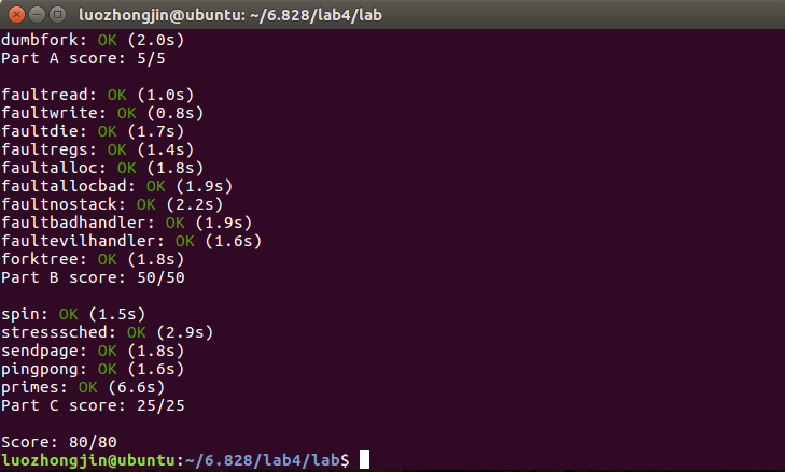

##Part A: Multiprocessor Support and Cooperative Multitasking

在Part A部分，我们将为JOS增加多处理器特性，实现轮转(RR)调度，增加用户环境管理的系统调用(创建和销毁环境，分配和映射内存)。 

## Multiprocessor Support(支持多处理器)

- JOS支持对称多处理器(SMP) — 一种多处理器架构
- 所有的CPU对等地访问系统资源
- 在SMP中所有CPU的功能是相同的，但是在启动过程中会被分为2类：
  - 引导处理器(BSP)负责初始化系统来启动操作系统
  - 当操作系统被启动后，应用处理器(APs)被引导处理器激活。
  - 引导处理器是由硬件和BIOS决定的，**我们目前所有的代码都是运行在BSP上(lab3前)**
- 在1个SMP系统中，**每个CPU有1个附属的Local APIC单元。**
  - APIC：Advanced Programmable Interrupt Controllers
  - LAPIC：本地高级可编程中断控制器
  - IOAPIC：I/O高级可编程中断控制器
  - **LAPIC单元负责处理系统中的中断，同时为它关联的CPU提供独一无二的标识符(ID)**


- **我们要利用 LAPIC 单元实现以下基本功能(在 kern/lapic.c)**
  - **读取LAPIC的标识符(ID)来告诉我们正在哪个CPU上运行代码(cpunum()).**
  - **从BSP发送STARTUP的处理器间中断(IPI: Inter-Processor Interrupt) 到APs来唤醒其它CPU(lapic_startap()).**
  - **在Part C部分，我们将编程LAPIC内置的计时器来触发时钟中断来支持多任务抢占(apic_init()).**

- MMIO(Memory mapping I/O)即[内存映射I/O]，I/O设备被放置在内存空间而不是I/O空间

  - 处理器访通过内存映射IO(MMIO)的方式访问它的LAPIC(设备)
  - 在MMIO中，一部分物理地址被硬连接到一些IO设备的寄存器，导致操作内存的指令load/store可以直接操作设备的寄存器。
  - 我们已经看到过1个IO hole在物理地址0xA0000(我们用这来写入VGA显示缓存)。
  - <u>LAPIC的空洞开始于物理地址0xFE000000(4GB之下第32MB)，但是这地址太高我们无法访问通过过去的**直接映射**(虚拟地址0xF0000000映射0x0，即只有256MB)</u>。**但是JOS虚拟地址映射预留了4MB空间在MMIOBASE处，我们需要分配映射空间，把其映射到一个物理空间上(Exercise 1)**
  - **一句话说就是，一部分物理地址硬连接到一些IO设备，I/O设备被映射到内存上，这样可以通过操作内存去操作外设**。

- **Exercise 1 — 将MMIOBASE映射到LAPIC空洞上**

  - 首先查看 ``kern/pmap.c``，会发现这里会调用一个映射，作用就是映射LAPIC空洞

    ```c
    // lapicaddr is the physical address of the LAPIC's 4K MMIO
    // region.  Map it in to virtual memory so we can access it.
    lapic = mmio_map_region(lapicaddr, 4096);
    ```

  - 我们要做的就是实现``kern/pmap.c``中的mmio_map_region函数，完成这个映射

    ```c
    void *
    mmio_map_region(physaddr_t pa, size_t size)
    {
    	// 类似于 nextfree 的静态变量
    	static uintptr_t base = MMIOBASE;
    	uintptr_t va_start = base, va_end;
    	// 向上页对齐
    	size = ROUNDUP(size, PGSIZE);
    	va_end = base + size;
    	// 如果要分配的空间低于MMIOBASE或者超过MMIOLIM,这发出错误
    	if (!(va_end >= MMIOBASE && va_end <= MMIOLIM))
    		panic("mmio_map_region: MMIO space overflow");
    	// 让base指向虚拟空间中MMIO空洞的空闲位置
    	base = va_end;
    	// 将设备的虚拟地址映射其真实的物理地址(cache访问不安全)
    	boot_map_region(kern_pgdir, va_start, size, pa, PTE_W | PTE_PCD | PTE_PWT);
    	// 返回设备在虚拟空间的地址
    	return (void *) va_start;
    }
    ```

    ​

### Application Processor Bootstrap

- 在启动APs之前，**BSP应该先收集关于多处理器系统的配置信息**，比如CPU总数，CPUs的APIC ID，LAPIC单元的MMIO地址等。在kern/mpconfig文件中的mp_init()函数通过读BIOS设定的MP配置表获取这些信息。 

- **boot_aps(kern/init.c)函数驱使AP引导程序**

- APs开始于实模式，跟BSP的开始相同，**故boot_aps函数拷贝AP入口代码(kern/mpentry.S)到实模式下的内存寻址空间**。但是跟BSP不一样的是，我们需要有一些控制当AP开始执行时。我们将拷贝入口代码到0x7000(MPENTRY_PADDR)。 

- 之后，**boot_aps函数通过发送STARTUP的IPI(处理器间中断)信号到AP的LAPIC单元来一个个地激活AP**。在kern/mpentry.S中的入口代码跟boot/boot.S中的代码类似。

- **在一些简短的配置后，它使AP进入开启分页机制的保护模式，调用C语言的setup函数mp_main。** 

- 总结：
  - 在boot.S中，由于尚没有启用分页机制
  - **在i386init函数中进行BSP启动的一些配置，经由lab2的 mem_init，lab3的env_init和trap_init，lab4的mp_init和lapic_init，**
  - 然后**boot_aps函数启动所有的CPU**。 
  - 多核处理器的初始化都在**mp_init函数**中完成
    - 首先是调用mpconfig函数，主要功能是寻找一个MP 配置条目，然后对所有的CPU进行配置，找到启动的处理器。 
    - 在启动过程中，mp_init和lapic_init是和硬件以及体系架构紧密相关的，通过读取某个特殊内存地址（当然前提是能读取的到，所以在mem_init中需要修改进行相应映射），来获取CPU的信息，根据这些信息初始化CPU结构。 
  - 在**boot_aps函数**中首先找到一段用于启动的汇编代码
    - 该代码和上一章实验一样是嵌入在内核代码段之上的一部分，其中mpentry_start和mpentry_end是编译器导出符号，代表这段代码在内存（虚拟地址）中的起止位置，接着把代码复制到MPENTRY_PADDR处。随后调用lapic_startap来命令特定的AP去执行这段代码。
  - 在boot_aps函数中将启动代码放到了MPENTRY_PADDR处，而代码的来源则是在kern/mpentry.S中，功能与boot.S中的非常类似，主要就是开启分页，转到内核栈上去，当然这个时候实际上内核栈还没建好。**在执行完mpentry.S中的代码之后，将会跳转到mp_main函数中去**。而这里需要提前做的，就是将MPENTRY_PADDR处的物理页表标识为已用，这样不会讲这一页放在空闲链表中分配出去。只需要在page_init中添加一个判断就可以。

- **boot_aps负责启动所有的应用处理器**

- **整个启动APs的过程是**

  - **调用mp_init()和lapic()对cpu和 lapic进行初始化**
  - **调用boot_aps函数**
    - **拷贝引导代码(mpentry.S)到0x7000(MPENTRY_PADDR)**
    - **找到一个CPU，执行引导代码，从而启动这个CPU，CPU启动后第一个调用的是mp_main，在mp_main函数中会调用sched_yield选择一个程序运行**
    - **重复2，直到引导完所有CPU**
    - ​

- **Exercise 2 —  保留MPENTRY_PADDR给APs引导代码**

  - 上面提到，在boot_aps函数中将启动CPU的代码放到了MPENTRY_PADDR处，故在物理页空闲链表初始化时，要MPENTRY_PADDR处的物理页标识为已用，避免其被分配出去。故修改``kern/pmap.c`` 的page_init函数


    ```c
    void
    page_init(void)
    {
    	size_t i;
    	size_t pgnum = PGNUM(PADDR(boot_alloc(0)));
    	for (i = 1; i < npages; i++) {
    		......
    		else if (i == PGNUM(MPENTRY_PADDR)){
    			continue;
    		}
    		......
    	}
    }
    ```

### Per-CPU State and Initialization

-  当编写一个多进程OS时，这是非常重要的去区分哪些是每个进程私有的CPU状态，哪些是整个系统共享的全局状态

- 在kern/cpu.h中定义了大部分的per-CPU状态。

-  **每个CPU独有的变量应该有：**
  - **内核栈，因为不同的核可能同时进入到内核中执行，因此需要有不同的内核栈**
  - **TSS描述符** 
  - **每个核的当前执行的任务**
  - **每个核的寄存器**

-  **Exercise 3 — 将每个CPU的内核栈映射到虚拟空间**

   ```C
   // 映射每一个cpu的内核栈
   static void
   mem_init_mp(void)
   {
   	// KSTKGAP -- 保护页
   	int i;
   	for (i = 0; i < NCPU; i++) {
   		intptr_t kstacktop_i = KSTACKTOP - i * (KSTKSIZE + KSTKGAP);
   		boot_map_region(kern_pgdir, kstacktop_i - KSTKSIZE, KSTKSIZE, 
   			PADDR(percpu_kstacks[i]), PTE_W | PTE_P);
   	}
   }
   ```

-  Exercise 4 — 初始化TSS，加载CPU的TSS选择子和IDT中断描述符表

   ```c
   // 加载CPU的TSS选择子和IDT中断描述符表
   void
   trap_init_percpu(void)
   {

   	int i = cpunum();
   	// Setup a TSS so that we get the right stack
   	// when we trap to the kernel.
   	thiscpu->cpu_ts.ts_esp0 = KSTACKTOP - i * (KSTKSIZE + KSTKGAP);
   	thiscpu->cpu_ts.ts_ss0 = GD_KD;		

   	// Initialize the TSS slot of the gdt.
   	gdt[(GD_TSS0 >> 3) + i] = SEG16(STS_T32A, (uint32_t)(&(thiscpu->cpu_ts)), sizeof(struct Taskstate) - 1, 0);
   	gdt[(GD_TSS0 >> 3) + i].sd_s = 0;

   	// Load the TSS selector (like other segment selectors, the
   	// bottom three bits are special; we leave them 0)
   	ltr(GD_TSS0 + 8 * i);

   	// Load the IDT
   	lidt(&idt_pd);
   }
   ```

### Locking

- 在mp_main函数中初始化AP后，代码就会进入自旋。

- **在让AP进行更多操作之前，我们首先要解决多CPU同时运行在内核时产生的竞争问题。**

- **最简单的办法是实现1个大内核锁，1次只让一个进程进入内核模式，当离开内核时释放锁。** 

- **在kern/spinlock.h中声明了大内核锁，提供了lock_kernel和unlock_kernel函数来快捷地获得和释放锁。总共有四处用到大内核锁：**
  - 在启动的时候，BSP启动其余的CPU之前，BSP需要取得内核锁
  - mp_main中，也就是CPU被启动之后执行的第一个函数，这里应该是调用调度函数，选择一个进程来执行的，但是**在执行调度函数之前，必须获取锁**
  - trap函数也要修改，因为可以访问临界区的CPU只能有一个，所以从用户态陷入到内核态的话，要加锁，因为可能多个CPU同时陷入内核态
  - env_run函数，也就是启动进程的函数，之前在试验3中实现的，在这个函数执行结束之后，就将跳回到用户态，此时离开内核，也就是需要将内核锁释放

- **加锁后，将原有的并行执行过程在关键位置变为串行执行过程，整个启动过程大概如下：** 
  -  **i386_init–>BSP获得锁–>boot_aps–>(BSP建立为每个cpu建立idle任务、建立用户任务，mp_main)—>BSP的sched_yield–>其中的env_run释放锁–>AP1获得锁–>执行sched_yield–>释放锁–>AP2获得锁–>执行sched_yield–>释放锁…**

- Exercise 5 — 大内核锁的应用

  ```
  //i386_init
  lock_kernel();
  boot_aps();

  //mp_main
  lock_kernel();
  sched_yield();

  //trap
  if ((tf->tf_cs & 3) == 3) {
      lock_kernel();
      assert(curenv);
      ......
  }

  //env_run
  lcr3(PADDR(curenv->env_pgdir));
  unlock_kernel();
  env_pop_tf(&(curenv->env_tf));
  ```

  ​	

### Round-Robin Scheduling(CPU)

-  接下来的任务是改变JOS内核，实现round-robin调度算法。 

- 主要是在sched_yield函数内实现，从该核上一次运行的进程开始，在进程描述符表中寻找下一个可以运行的进程，如果没找到而且上一个进程依然是可以运行的，那么就可以继续运行上一个进程

- 同时将这个算法实现为一个系统调用，使得进程可以主动放弃CPU。 

- **Exercise 6 — 实现调度算法****(轮询)**

  - 实现sched_yield函数

    ```
    void
    sched_yield(void)
    {
    	struct Env *idle;
    	int i, nexti = 0;
    	if (curenv != NULL)
    		nexti = (ENVX(curenv->env_id) + 1) % NENV;
    	// 轮询，找一个进程去运行
    	for (i = 0; i < NENV; i++) {
    		if (envs[nexti].env_status == ENV_RUNNABLE){
    			env_run(&envs[nexti]);
    			return;
    		}
    		nexti = (nexti + 1) % NENV;
    	}
    	if (curenv != NULL && curenv->env_status == ENV_RUNNING){
    			env_run(curenv);
    			return;
    	}
    	// sched_halt never returns
    	sched_halt();
    }
    ```

  - 为了实现进程可以主动放弃CPU，需要实现一个系统调用

    ```
    int32_t
    syscall(uint32_t syscallno, uint32_t a1, uint32_t a2, uint32_t a3, uint32_t a4, uint32_t a5)
    {
    	switch (syscallno) {
    	......
    	case SYS_yield:
    		sys_yield();
    		return 0;
    	......
    }
    ```

    ​

### System Calls for Environment Creation(进程创建系统调用的实现)

- 虽然你的内核现在有能力运行和切换多用户级进程，但是它仍然**只能跑内核初始创建的进程。**

- **实现必要的JOS系统调用**允许用户进程创建和启动其它新的用户进程。 **即要实现用户进程通过系统调用创建新的用户进程**

- Unix提供了fork系统调用来创建进程，它拷贝父进程的整个地址空间到新创建的子进程。两个进程之间唯一的区别是它们的进程ID，在父进程fork返回的是子进程ID，而在子进程fork返回的是0。 ???????????

- 你将实现1个不同的更原始的JOS系统调用来创建进程。利用这些系统调用能实现类似Unix的fork函数。

- 用户级fork函数在user/dumbfork.c中的**dumbfork**中，**该函数将父进程中所有页的内容全部复制过来，唯一不同的地方就是返回值不同。**

- Exercise 7 — 实现进程创建时的系统调用

  - 首先是sys_exofork函数，这个系统调用将创建1个新的空白进程，没有映射的用户空间且无法运行。在调用函数时新进程的寄存器状态与父进程相同，但是在父进程会返回子进程的ID，而子进程会返回0。通过设置子进程的eax为0，来让系统调用的返回值为0。？？？？这句话不是很理解

    ```
    static envid_t
    sys_exofork(void)
    {
    	struct Env *e;
    	// 申请一个新进程
    	int ret = env_alloc(&e, curenv->env_id);
    	if (ret < 0) 
    		return ret;
    	
    	// 初始化新进程
    	e->env_status = ENV_NOT_RUNNABLE;
    	e->env_tf = curenv->env_tf;
    	// 将子进程的返回值设置为0
    	e->env_tf.tf_regs.reg_eax = 0;

    	return e->env_id;
    }
    ```

  - 接下来是sys_env_set_status，一旦进程的地址空间和寄存器状态都初始化之后，就会调用此函数设置进程的运行状态。必须为ENV_RUNNABLE or ENV_NOT_RUNNABLE

    ```c
    static int
    sys_env_set_status(envid_t envid, int status)
    {
    	struct Env *e;
    	int ret;

    	if ((ret = envid2env(envid, &e, 1)) < 0)
    		return ret;

    	if (status != ENV_RUNNABLE && status != ENV_NOT_RUNNABLE)
    		return -E_INVAL;

    	e->env_status = status;

    	return 0;
    }
    ```

  - 然后是env_page_alloc函数，分配1个物理页并映射到给定进程的进程空间的指定的虚拟地址

    ```c
    // 分配1个物理页并映射到给定进程的进程空间的虚拟地址
    static int
    sys_page_alloc(envid_t envid, void *va, int perm)
    {
    	struct Env *e;
    	struct PageInfo *pp;
    	int ret;

    	if ((ret = envid2env(envid, &e, 1)) < 0)
    		return ret;

    	if (va >= (void *)UTOP || PGOFF(va) != 0)
    		return -E_INVAL;

    	if ((perm & (PTE_U | PTE_P)) != (PTE_U | PTE_P) || (perm & ~PTE_SYSCALL) != 0)
    		return -E_INVAL;

    	// 申请一个物理页
    	if ((pp = page_alloc(ALLOC_ZERO)) == NULL)
    		return -E_NO_MEM;
    	
    	// 映射物理页到进程的虚拟空间中
    	if ((ret = page_insert(e->env_pgdir, pp, va, perm)) < 0) {
    		page_free(pp);
    		return ret;
    	}

    	return 0;
    }
    ```

  - 接着是sys_page_map函数，从1个进程的页表中拷贝1个页映射到另1个进程的页表中(将进程id为srcenvid的进程的srcva处的物理页的内容，映射到进程id为dstenvid的进程的dstva处)

    ```C
    // 从1个进程的页表中拷贝1个页映射到另1个进程的页表中
    // 复制一个页映射
    static int
    sys_page_map(envid_t srcenvid, void *srcva,
    	     envid_t dstenvid, void *dstva, int perm)
    {
    	struct Env *srcenv, *dstenv;
    	struct PageInfo *pp;
    	pte_t *pte;
    	int ret;
    	
    	if ((ret = envid2env(srcenvid, &srcenv, 1)) < 0)
    		return ret;
    	if ((ret = envid2env(dstenvid, &dstenv, 1)) < 0)
    		return ret;

    	if (srcva >= (void *) UTOP || PGOFF(srcva) != 0)
    		return -E_INVAL;
    	if (dstva >= (void *) UTOP || PGOFF(dstva) != 0)
    		return -E_INVAL;
    	
    	if ((perm & (PTE_U | PTE_P)) != (PTE_U | PTE_P) || (perm & ~PTE_SYSCALL) != 0)
    		return -E_INVAL;
    	
    	// 查到进程 srcenv 的虚拟地址srcva对应的物理页
    	if ((pp = page_lookup(srcenv->env_pgdir, srcva, &pte)) == NULL)
    		return -E_INVAL;

    	if ((perm & PTE_W) && !(*pte & PTE_W))
    		return -E_INVAL;
    	
    	// 将进程虚拟地址 dstva 对应的虚拟页映射到物理页pp 
    	if ((ret = page_insert(dstenv->env_pgdir, pp, dstva, perm)) < 0)
    		return ret;
    	
    	return 0;
    }
    ```

  - 接下来是sys_page_unmap函数，解除指定进程中的1个页映射。

    ```c
    // 解除进程 envid 虚拟地址 va 对应的页映射
    static int
    sys_page_unmap(envid_t envid, void *va)
    {
    	struct Env* e;
    	int ret;

    	if ((ret = envid2env(envid, &e, 1)) < 0)
    		return ret;

    	if (va >= (void *) UTOP || PGOFF(va) != 0)
    		return -E_INVAL;
    	
    	// 解除映射
    	page_remove(e->env_pgdir, va);

    	return 0;
    }
    ```

  - 最后不要忘记在 ``syscall.c``里面做好分发(查了两个小时，气死了)

    ```c
    // Dispatches to the correct kernel function, passing the arguments.
    int32_t
    syscall(uint32_t syscallno, uint32_t a1, uint32_t a2, uint32_t a3, uint32_t a4, uint32_t a5)
    {
    	......
    	case SYS_page_alloc:
    		return sys_page_alloc(a1, (void *) a2, a3);
    	case SYS_page_map:
    		return sys_page_map(a1, (void *) a2, a3, (void *) a4, a5);
    	case SYS_page_unmap:
    		return sys_page_unmap(a1, (void *) a2);
    	case SYS_exofork:
    		return sys_exofork();
    	case SYS_env_set_status:
    		return sys_env_set_status(a1, a2);
    	......
    	}
    }
    ```

    ​

##Part B: Copy-on-Write Fork写时拷贝

- 避免拷贝大量根本不会被使用的数据

### User-level page fault handling 

- 写时拷贝
  - 写时拷贝是一种可以推迟甚至免除拷贝数据的技术，即内核此时并不复制整个进程地址空间，而是让父进程和子进程共享同一个拷贝。
  - 只有在需要写入的时候，数据才会被复制，从而使各个进程拥有各自的拷贝。
  - 也就是说，资源的复制只有在需要写入的时候才进行，在此之前，只是以只读方式共享。
  - 这种技术使地址空间上的页的拷贝被推迟到实际发生写入的时候。在页根本不会被写入的情况下，它们就无需复制了。
  - fork()的实际开销就是复制父进程的页表以及给子进程创建惟一的进程描述符。
  - 在系统中，进程创建后都会马上运行一个可执行的文件，这种优化可以避免拷贝大量根本就不会被使用的数据。
- fork()函数
  - 之前所用的**dumbfork函数**将父进程中所有页的内容全部复制到子进程
  - 而后面要实现的fork()函数采用COW技术
    - 当创建一个新的子进程的时候，只需要拷贝父进程的内存映射(页表)就可以了，而且将父进程所有的内存映射页**都标记为只读**的，这样，当子进程或者父进程尝试去读的时候是安全的
    - 而**当尝试去写的时候，就会出发page fault**，而在page fault处理例程中，单独将被写入的页(比如说栈)拷贝一份，修改掉发出写行为的进程的页表相应的映射就可以了。

####User-level page fault handling

#### Setting the Page Fault Handler

- 为了处理用户态的页错误，需要在Jos内核中注册一个页错误处理函数

- 用env结构中增加的env_pgfaulut_upcall记录页错误处理函数

- 实现ses_env_set_pgfault_upcall，将用户态自己的处理页错误的函数注册到进程结构中

  ```c
  // 将用户态的页错误处理函数注册到进程结构中
  static int
  sys_env_set_pgfault_upcall(envid_t envid, void *func)
  {
  	// LAB 4: Your code here.
  	//panic("sys_env_set_pgfault_upcall not implemented");

  	struct Env *e;
  	int ret;
  	
  	if ((ret = envid2env(envid, &e, 1)) < 0)
  		return ret;

  	e->env_pgfault_upcall = func;
  	return 0;
  }
  ```

#### Normal and Exception Stacks in User Environments

- 在正常运行期间，用户进程运行在用户栈上，**栈顶寄存器ESP指向USTACKTOP处**,堆栈数据位于USTACKTOP-PGSIZE 与USTACKTOP-1之间的页
- 当在用户模式发生1个page fault时，内核将在专门处理page fault的**用户异常栈上重新启动进程。** 
  - 异常栈是为了上面设置的异常处理例程（流程&函数）设立的
  - **当异常发生时，而且该用户进程注册了该异常的处理例程，那么就会转到异常栈上，运行异常处理例程。**
- 到目前位置出现了三个栈： 
  - 内核态系统栈：[KSTACKTOP, KSTACKTOP-KSTKSIZE] 
  - 用户态错误处理栈：[UXSTACKTOP, UXSTACKTOP - PGSIZE] 
  - 用户态运行栈：[USTACKTOP, UTEXT] 
- 用户定义注册了自己的中断处理程序之后，相应的页错误流程如下： 
  - 发生页错误时，首先陷入到内核，栈位置从用户运行栈切换到内核栈，进入到trap中，进行中断处理分发，**进入到page_fault_handler()** 
  - 当确认是用户程序触发的page fault的时候(内核触发的直接panic了)，为其在用户错误栈里**分配一个UTrapframe的大小** 
  - **把栈切换到用户异常栈，运行相应的用户中断处理程序**(中断处理程序可能会触发另外一个同类型的中断，这个时候就会产生递归式的处理。处理完成之后，返回到用户运行栈。 )

####**Invoking the user page fault handle** 

- 可以将用户自己定义的**用户处理进程当作是一函数调用看待**

  - **当错误发生的时候**，调用一个函数，但实际上**还是当前这个进程**，并没有发生变化。(只是调用了一个中断函数)

  - 所以当切换到异常栈的时候，依然运行当前进程，但只是运行的中断处理函数

  - 此时的栈指针发生了变化，而且程序计数器eip也发生了变化，同时还需要知道的是引发错误的地址在哪。这些都是要在切换到异常栈的时候需要传递的信息**(切换态最重要要传递信息 — 利用栈实现)**

- **和之前从用户栈切换到内核栈一样，这里是通过在栈上构造结构体，传递指针完成的。**

- 这里新定义了一个结构体用来记录出现用户定义错误时候的信息Utrapframe：

  ```c
  struct UTrapframe {
          /* information about the fault */
          uint32_t utf_fault_va;  /* va for T_PGFLT, 0 otherwise */
          uint32_t utf_err;
          /* trap-time return state */
          struct PushRegs utf_regs;
          uintptr_t utf_eip;
          uint32_t utf_eflags;
          /* the trap-time stack to return to */
          uintptr_t utf_esp;
  } __attribute__((packed));
  ```

  - 相比于Trapframe，这里**多了utf_fault_va**，因为要记录触发错误的内存地址。同时**还少了es,ds,ss**等，因为从用户态栈切换到异常栈，或者从异常栈再切换回去，实际上都是一个用户进程，所以不涉及到段的切换，不用记录。
  - Trapframe & UTrapframe都是为了切换运行态时传递信息用
    - 套路：设置堆栈 — 调用相应的处理函数

- 整体上讲，当正常执行过程中发生了页错误，那么栈的切换是 

  - 用户运行栈—>内核栈—>异常栈 
  - 而如果在异常处理程序中发生了也错误，那么栈的切换是
    - 异常栈—>内核栈—>异常栈 

- **Exercise 9 — 实现page_fault_handler函数来分发page fault到用户模式的处理函数。**

  - 根据tf构造用户异常栈(借助utf)

  - esp 指向用户异常栈  eip 指向进程中断(页错误)处理函数的入口位置

  - 重新运行进程，此时会将用户异常栈的值pop到寄存器(重点esp/eip寄存器改变了)

    ```c
    // tf为现场信息(发生错误时的各寄存器快照)
    // 1.根据tf构造用户异常栈(借助utf)
    // 2.esp 指向用户异常栈  eip 指向进程中断(页错误)处理函数的入口位置
    // 3.重新运行进程，此时会将用户异常栈的值pop到寄存器
    void
    page_fault_handler(struct Trapframe *tf)
    {
    	uint32_t fault_va;

    	// Read processor's CR2 register to find the faulting address
    	// cr2寄存器存有错误发生的地址
    	fault_va = rcr2();

    	// Handle kernel-mode page faults.

    	// LAB 3: Your code here.
    	if ((tf->tf_cs & 0x3) == 0) 
    		panic("page_fault_handler: page fault in kernel mode");

    	// 用户态页错误
    	// 把现场信息记录下来，构建用户异常栈数据结构，然后改变esp eip
    	struct UTrapframe *utf;
    	if (curenv->env_pgfault_upcall != NULL) {
    		
    		// 判断发生错误时堆栈指针是否处于用户异常栈，如果是，留出一个字的空间存返回值
            if (UXSTACKTOP - PGSIZE <= tf->tf_esp && tf->tf_esp <= UXSTACKTOP - 1)
                    utf = (struct UTrapframe *)(tf->tf_esp - sizeof(struct UTrapframe) - 4);
            else
                    utf = (struct UTrapframe *)(UXSTACKTOP - sizeof(struct UTrapframe));
            user_mem_assert(curenv, (void *)utf, sizeof(struct UTrapframe), PTE_U | PTE_W);
    		
    		// 构构造utf(用户异常栈)
            utf->utf_fault_va = fault_va;
            utf->utf_err = tf->tf_trapno;
            utf->utf_eip = tf->tf_eip;
            utf->utf_eflags = tf->tf_eflags;
            utf->utf_esp = tf->tf_esp;
            utf->utf_regs = tf->tf_regs;
    		
    		
    		// 将进程的堆栈指针指向用户异常栈
            tf->tf_esp = (uint32_t)utf;

    		// 将进程的下一条指令的指针指向进程的中断处理函数的入口位置
            tf->tf_eip = (uint32_t)curenv->env_pgfault_upcall;
    	
    		// 重新运行进程(将用户异常栈的值pop到寄存器)
            env_run(curenv);
    	} 

    	// Destroy the environment that caused the fault.
    	cprintf("[%08x] user fault va %08x ip %08x\n",
    	curenv->env_id, fault_va, tf->tf_eip);
    	print_trapframe(tf);
    	env_destroy(curenv);
    }
    ```

    ​


#### User-mode Page Fault Entrypoint 

- _pgfault_upcall是所有**用户页错误处理程序的入口**，在这里**调用用户自定义的处理程序**，并在处理完成后，从**错误栈中保存的UTrapframe中恢复相应信息**，**然后跳回到发生错误之前的指令**，**恢复原来的进程运行。**

- Exercise 10

  ```assembly
  #include <inc/mmu.h>
  #include <inc/memlayout.h>

  .text
  .globl _pgfault_upcall
  _pgfault_upcall:
  	// Call the C page fault handler.
  	pushl %esp			// function argument: pointer to UTF
  	movl _pgfault_handler, %eax
  	call *%eax
  	addl $4, %esp			// pop function argument
  	
  	// LAB 4: Your code here.
  	movl 48(%esp), %eax
  	subl $4, %eax
  	movl 40(%esp), %edx
  	movl %edx, (%eax)
  	movl %eax, 48(%esp)

  	// Restore the trap-time registers.  After you do this, you
  	// can no longer modify any general-purpose registers.
  	// LAB 4: Your code here.
  	addl $8, %esp
  	popal
  	// Restore eflags from the stack.  After you do this, you can
  	// no longer use arithmetic operations or anything else that
  	// modifies eflags.
  	// LAB 4: Your code here.
  	addl $4, %esp
  	popfl

  	// Switch back to the adjusted trap-time stack.
  	// LAB 4: Your code here.
  	// 恢复错误现场运行堆栈
  	popl %esp

  	// 返回错误现场继续执行
  	// Return to re-execute the instruction that faulted.
  	// LAB 4: Your code here.
  	ret
  ```


- set_pgfault_handler：用户程序可调用的页错误处理函数的设置函数，包含用户异常栈的初始化和页错误处理函数的设置，利用前面的sys_env_set_pgfault_upcall函数注册用户页错误处理函数。

  ```c
  // 页错误处理函数的设置函数
  void
  set_pgfault_handler(void (*handler)(struct UTrapframe *utf))
  {
  	int r;
  	int envid=sys_getenvid();
  	if (_pgfault_handler == 0) {
  		// First time through!
  		// LAB 4: Your code here.
  		// panic("set_pgfault_handler not implemented"); 
  		// 分配异常栈
  		if ((r = sys_page_alloc(envid, (void *) (UXSTACKTOP-PGSIZE), 
  				PTE_W | PTE_U | PTE_P)) < 0)
  			panic("set_pgfault_handler: %e\n", r);
  	}

  	// Save handler pointer for assembly to call.
  	// 将用户自定义的页错误处理函数注册到_pgfault_upcall
  	// _pgfault_handler是_pgfault_upcall里会调用的一个函数
  	_pgfault_handler = handler;
  	
  	// 注册页错误处理到进程结构
  	if ((r = sys_env_set_pgfault_upcall(envid, _pgfault_upcall)) < 0)
  		panic("set_pgfault_handler: %e\n", r);
  }
  ```


- **对整个用户态页错误函数的设置做个总结：**
  - **_pgfault_upcall是所以页错误处理程序的入口，在这里会调用 _pgfault_handler**
  - **注册页错误处理函数时，调用set_pgfault_handler()函数，它会将用户自定义的页错误处理函数handler注册到\_pgfault_upcall里(即语句\_pgfault\_handler = handler)，使得_pgfault_upcall拥有一个完整的页错误流程，最后将\_pgfault_upcall注册到用户进程结构中，即完成整个设置过程。**


- **对整个用户态写页错误处理流程做个总结：**
  - **由于COW发生写页错误时，从用户态陷入到内核态，调用trap()函数对错误进行分发**
  - **trap()函数将错误引导到page_fault_handler函数，page_fault_handler判断此为用户态页错误page_fault_handler后，构造utf(异常栈)，保存现场信息，而使将esp指向异常栈，eip指向页错误函数入门地址(currenv->env_pgfault_upcall)，最后调用env_run()重新运行进程**
  - **env_run()调用env_pop_tf()函数将相应的值pop到相应的寄存器，此时esp寄存器的地址为异常栈地址，eip寄存器地址为页错误处理函数入口地址，从而进程开始执行页错误处理函数(\_pgfault_upcall)，\_pgfault_upcall函数调用用户自定义处理函数\_pgfault_handler后会返回出错现场继续运行。**


####Implementing Copy-on-Write Fork

- 接下来就是最重要的部分：实现copy-on-write fork。 

- 与之前的dumbfork不同，fork出一个子进程之后，首先要进行的就是将父进程的页表的全部映射拷贝到子进程的地址空间中去，这个时候物理页会被两个进程同时映射，即共享。

- 当父进程或者子进程任意一个发生了写的时候，因为页表现在都是不可写的，所以会触发异常，进入到我们设定的page fault处理函数

- Exercise 12 — 实现在lib/fork.c的fork，duppage和pgfault。

  - 首先是pgfault处理page fault时的写时拷贝

    ```c
    // 进程页错误处理函数 -- 复制一份需要写的页出来写
    // 分配一个物理页，将要写的物理页拷贝到新的物理页，映射原虚拟地址到新的物理页(交换)
    static void
    pgfault(struct UTrapframe *utf)
    {
        int r;
        // 发生页错误的地址
        void *addr = (void *) utf->utf_fault_va;
        uint32_t err = utf->utf_err;
        
    	// 检查页错误是否写错误以及需要写的页是否是COW页
    	if ((err & FEC_WR) == 0 || (uvpt[PGNUM(addr)] & PTE_COW) == 0)
    		panic("pgfault: it's not writable or attempt to access a non-cow page!");
    	envid_t envid = sys_getenvid();
    	
        // 分配一个物理页，并映射到临时虚拟地址PFTEMP
        if ((r = sys_page_alloc(envid, (void *)PFTEMP, PTE_P | PTE_W | PTE_U)) < 0)
            panic("pgfault: page allocation failed %e", r);
        
        addr = ROUNDDOWN(addr, PGSIZE);
        memmove(PFTEMP, addr, PGSIZE);
        // 解除虚拟地址的映射
        if ((r = sys_page_unmap(envid, addr)) < 0)
            panic("pgfault: page unmap failed %e", r);
        // 将虚拟地址映射到新的物理页
        if ((r = sys_page_map(envid, PFTEMP, envid, addr, PTE_P | PTE_W |PTE_U)) < 0)
            panic("pgfault: page map failed %e", r);
        // 解除 PFTEMP 的映射
    	if ((r = sys_page_unmap(envid, PFTEMP)) < 0)
            panic("pgfault: page unmap failed %e", r);
    	//panic("pgfault not implemented");
    }
    ```

  - duppage函数，负责进行COW方式的页复制，将当前进程的第pn虚拟页对应的物理页的映射到envid的第pn虚拟页上去，同时将这一页都标记为COW。

    ```c
    // 负责复制页映射
    // 将当前进程的第pn页对应的物理页映射到envid的第pn页
    // 其实就是共享父进程资源
    static int
    duppage(envid_t envid, unsigned pn)
    {
    	int r;
    	// 求第 pn 页对应的虚拟地址
    	void *addr = (void *) (pn * PGSIZE);
    	uint32_t perm = PTE_U | PTE_P;

    	// LAB 4: Your code here.
    	if (uvpt[pn] & (PTE_W | PTE_COW)) 
    		perm |= PTE_COW;
    	
    	// 映射到子进程
    	if ((r = sys_page_map(sys_getenvid(), addr, envid, addr, perm)) < 0)
    		panic("sys_page_map: %e", r);
    	
    	if (!(perm & PTE_COW))
    		return 0;
    	
    	//父进程也修改权限(这里重新映射一遍达到权限修改的目的)
    	if ((r = sys_page_map(sys_getenvid(), addr, sys_getenvid(), addr, perm)) < 0)
    		panic("sys_page_map: %e", r);
    	return 0;
    }
    ```

  - 最后是fork函数，这个函数记录着整个创建进程的流程

    - 设置页错误处理函数使用pgfault函数
    - 调用系统调用创建一个进程
    - 使用duppage函数将父进程页映射复制到进程
    - 为子进程设置页错误处理函数
    - 设置子进程的状态为 runable

    ```c
    envid_t
    fork(void)
    {
    	envid_t envid;
    	uint8_t *addr, *end_addr;
    	int ret;
    	
    	// 注册pgfault函数(生成页错误处理函数)
    	set_pgfault_handler(&pgfault);
    	
    	//系统调用 -- 创建一个新的进程
    	envid = sys_exofork();
    	if (envid < 0) 
    		return envid;
    	if (envid == 0) {
    		// We are the child
    		thisenv = &envs[ENVX(sys_getenvid())];
    		return 0;
    	}
    	
    	// 一一映射页表
    	end_addr = (uint8_t *) (UXSTACKTOP - PGSIZE);
    	for (addr = 0; addr < end_addr; addr += PGSIZE) {	
    		if ((uvpd[PDX(addr)] & PTE_P) && (uvpt[PGNUM(addr)] & PTE_P))
    			duppage(envid, PGNUM(addr));
    	}

    	//为子进程分配异常栈
    	ret = sys_page_alloc(envid, 
    		(void *)(UXSTACKTOP - PGSIZE), PTE_U|PTE_W|PTE_P); 
    	if (ret < 0)
    		return ret;
    	
    	// 为子进程设置页错误处理句柄
    	if ((ret = sys_env_set_pgfault_upcall(envid, thisenv->env_pgfault_upcall)) < 0)
    		return ret;
    	
    	// 标记子进程为runable
    	if ((ret = sys_env_set_status(envid, ENV_RUNNABLE)) < 0)
    		return ret;

    	return envid;
    }
    ```


###Part C: Preemptive Multitasking and Inter-Process communication (IPC)可抢占时调度和进程通信

#### **Clock Interrupts and Preemption** 

- 先前的调度是进程资源放弃CPU，但是实际中没有进程会这样做的，而为了不让某一进程耗尽CPU资源，需要抢占式调度，也就需要硬件定时。

- 但是外部硬件定时在Bootloader的时候就关闭了，至今都没有开启。而JOS采取的策略是，在内核中的时候，外部中断是始终关闭的，在用户态的时候，需要开启中断。 外部中断是由 eflags 标志寄存器的 FL_IF 位控制的，在 JOS 中我们只在进入和离开用户模式时保存和恢复 eflags 寄存器。并确保 FL_IF 标志在用户进程运行时置位，这样当时钟中断时，内核可以得到处理器继续调度其他进程。

- 在 JOS 中我们的抢占原则是**时间片原则**
  - 即各进程按系统分配给的一个时间片运行
  - 当该时间片用完或由于该进程等待某事件发生而被阻塞时，系统就停止该进程的执行而重新进行调度。

- Exercise 13 — 增加定时中断

  - 首先和lab3的中断处理类似，为定时中断设置一个中断处理函数，修改``kern/trapentry.S``

    ```c
    TRAPHANDLER_NOEC(timer, IRQ_OFFSET + IRQ_TIMER);
    ```

  - 然后在IDT中注册，修改trap_init

    ```c
    //在kern/trap.c声明以下函数
    void timer();
    //trap_init
    SETGATE(idt[IRQ_OFFSET+IRQ_TIMER], 0, GD_KT, timer, 0);
    ```

  - 最后在env_alloc函数中打开中断

    ```c
    // Enable interrupts while in user mode
    // 用户态下允许中断
    e->env_tf.tf_eflags |= FL_IF;
    ```

#### Handling Clock Interrupts

- 现在虽然中断使能已经打开，在用户态进程运行的时候，外部中断会产生并进入内核，但是现在还没有能处理这类中断。所以需要修改trap_dispatch，在发生外部定时中断的时候，调用调度器，调度另外一个可运行的进程。 

- Exercise 14：修改trap_dispatch函数，当发生时钟中断时调用sched_yield函数来调度下一个进程

  ```c
  static void
  trap_dispatch(struct Trapframe *tf)
  {
  	if (tf->tf_trapno == IRQ_OFFSET + IRQ_SPURIOUS) {
  		cprintf("Spurious interrupt on irq 7\n");
  		print_trapframe(tf);
  		return;
  	}

  	if (tf->tf_trapno == IRQ_OFFSET + IRQ_SPURIOUS) {
  		cprintf("Spurious interrupt on irq 7\n");
  		print_trapframe(tf);
  		return;
  	}
  	switch(tf->tf_trapno){
  		......
  		case(IRQ_OFFSET + IRQ_TIMER):
  			lapic_eoi();
  			sched_yield();
  			return;
  		......
  }
  ```


###Inter-Process communication (IPC)

- 在前面，JOS 系统主要是考虑操作系统隔离性，即每一个进程都好像独占一台机器一样
- **而操作系统另一个重要的服务**，进程之间相互通信即 IPC(inter-process communication)**:进程间通信**。允许进程通信，进程间可以合作完成一个整体的任务。

  - 传统上有许多进程间通信的方式，比如信号量，管道等
  - **我们在 JOS 系统中使用简单的消息传递来实现进程间通信。**
    - **在 JOS 的 IPC 机制中传送和接受的消息包括两类: 单字，单字和一个页的映射;后者可以高效传送大量的数据。**
- **在JOS实现IPC的方式是当两个进程需要通信的话，一方要发起recv，然后阻塞，直到有一个进程调用send向正在接受的进程发送了信息，阻塞的进程才会被唤醒。**

  - **在JOS中，可以允许传递两种信息，一是一个32位整数，另外一个就是传递页的映射，在这个过程中，接收方和发送方将同时映射到一个相同的物理页，此时也就实现了内存共享。最后将这两个功能实现在了同一个系统调用。** 

#### Implementing IPC

- 在JOS的IPC实现机制中，修改Env结构体

  ```c
  struct Env {
          // Lab 4 IPC
          bool env_ipc_recving;      // Env is blocked receiving
          void *env_ipc_dstva;       // VA at which to map received page
          uint32_t env_ipc_value;    // Data value sent to us
          envid_t env_ipc_from;      // envid of the sender
          int env_ipc_perm;          // Perm of page mapping received
  };
  ```

- 其中增加了5个成员： 

  - env_ipc_recving：标识进程是否处理等待接受状态，1为等待
  - env_ipc_dstva：如果进程要接受消息并且是传送页，保存页映射的地址，且该地址<=UTOP
  - env_ipc_value：若等待消息的进程接收到消息，发送方将接收方此成员设置为消息值
  - env_ipc_from：发送方负责设置该成员为自己的envid号。
  - env_ipc_perm： 如果进程要接收消息并且传送页，那么发送方发送页之后将传送的页权限赋给这个成员

- Exercise 15： 实现发送消息和接受消息的系统调用(页传送和字传送混合一起)

  - 首先是sys_ipc_recv函数，其功能是当一个进程试图去接收信息的时候

    - 将进程标记为正在接收信息，设置它的接受页
    - 而且为了不浪费CPU资源，应该同时标记其为ENV_NOT_RUNNABLE，并调用调度器运行其他进程。

    ```c
    // 提供一页用于接受信息
    // 参数为接受消息的虚拟页的起始地址
    static int
    sys_ipc_recv(void *dstva)
    {
    	// LAB 4: Your code here.
    	if (dstva < (void *) UTOP && dstva != ROUNDDOWN(dstva, PGSIZE))
    		return -E_INVAL;
    	
    	curenv->env_ipc_recving = 1;
    	curenv->env_ipc_dstva = dstva;
    	curenv->env_status = ENV_NOT_RUNNABLE;
    	sys_yield();

    	return 0;
    }
    ```

  - 接着是sys_ipc_try_send函数

    - 首先要在发送方的页表中找到srcva对应的物理页
    - 然后把接收方给定的虚地址映射到该物理页
    - 最后，将接受方设置为可运行，同时把env_ipc_recving设置为0，以防止其他的进程再发送，覆盖掉当前的内容

    ```c
    // 此处将页传送页字传送混合一起了
    static int
    sys_ipc_try_send(envid_t envid, uint32_t value, void *srcva, unsigned perm)
    {
    	// LAB 4: Your code here.
    	//panic("sys_ipc_try_send not implemented");
    	struct Env *env;
    	int r;
    	if ((r = envid2env(envid, &env, 0)) < 0)
    		return -E_BAD_ENV;
    	if (env->env_ipc_recving == 0)
    		return -E_IPC_NOT_RECV;
    	if (srcva < (void *) UTOP) {
    		// int flag = PTE_U | PTE_P;
    		// if ((perm & flag) != flag)
    		// 	return -E_INVAL;

    		// if (perm & (~(PTE_U | PTE_P | PTE_AVAIL | PTE_W)))
    		// 	return -E_INVAL;

    		if (srcva != ROUNDDOWN(srcva, PGSIZE))
    			return -E_INVAL;
    		
    		// 根据发送者(当前进程)提供的虚拟地址找到对应的物理页，再将该物理页映射到接受者的虚拟空间

    		pte_t *pte;
    		// 1.根据发送者提供的虚拟地址查找发送内容所在的物理页
    		struct PageInfo *page = page_lookup(curenv->env_pgdir, srcva, &pte);
    		if (!page)
    			return -E_INVAL;

    		if ((*pte & perm) != perm) return -E_INVAL;

    		if ((perm & PTE_W) && !(*pte & PTE_W))
    			return -E_INVAL;
    		// 2.将物理页映射到接受者的虚拟空间中
    		if (env->env_ipc_dstva < (void *) UTOP) {
    			if ((r = page_insert(env->env_pgdir, page, env->env_ipc_dstva, perm)) < 0)
    				return -E_NO_MEM;
    			env->env_ipc_perm = perm;
    		}
    	}
    	// 3.更新接受者的信息，通知其消息已经发送
    	env->env_ipc_recving = 0;
    	env->env_ipc_from = curenv->env_id;
    	env->env_ipc_value = value;
    	// 将接受进程设置为ENV_RUNNABLE，使得其可以重新参与调度
    	env->env_status = ENV_RUNNABLE;
    	// ？？？
    	env->env_tf.tf_regs.reg_eax = 0;
    	return 0;
    }
    ```

  - 接下来是用户态的ipc，ipc_recv用于接受

    ```c
    int32_t
    ipc_recv(envid_t *from_env_store, void *pg, int *perm_store)
    {
    	int r;

    	if (from_env_store)
    		*from_env_store = 0;

    	if (perm_store)
    		*perm_store = 0;

    	if (!pg)
    		pg = (void *) -1;

    	// 系统调用
    	if ((r = sys_ipc_recv(pg)) < 0) {
    		cprintf("im dead");
    		return r;
    	}
    	
    	// 存储发送者id
    	if (from_env_store)
    		*from_env_store = thisenv->env_ipc_from;
    	
    	// 存储权限
    	if (perm_store)
    		*perm_store = thisenv->env_ipc_perm;
    	
    	// 返回接受到的值
    	return thisenv->env_ipc_value;
    }
    ```

  - 最后是用户态发送函数，ipc_send

    ```c
    void
    ipc_send(envid_t to_env, uint32_t val, void *pg, int perm)
    {
    	// LAB 4: Your code here.
    	// panic("ipc_send not implemented");
    	int r;

    	//she zhi wei gao wei
    	if (!pg)
    		pg = (void *) -1;
    	// 不断发送，知道发送成功
    	while ((r = sys_ipc_try_send(to_env, val, pg, perm)) < 0) {
    		if (r != -E_IPC_NOT_RECV)
    			panic("ipc_send: %e", r);
    		sys_yield();
    	}
    }
    ```




