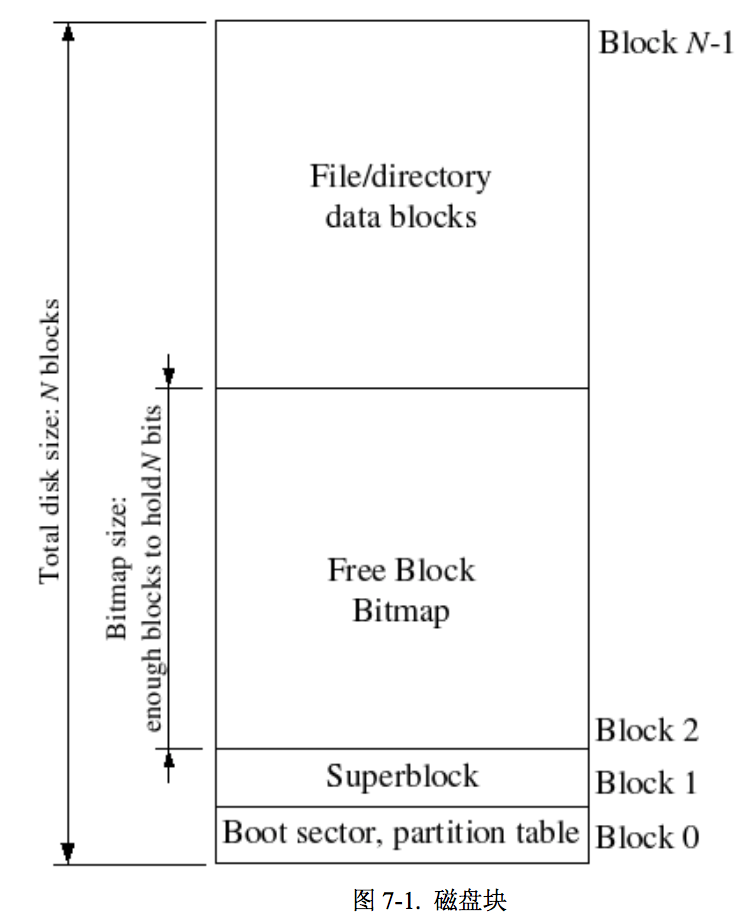

## Lab 5: File system, Spawn and Shell

- 该实验分为 2 部分:文件系统服务器、客户端和 Spawn函数。前者为其他进程提供访问文件系统的服务，客户端进程通过发送 IPC请求完成文件的操作;后者从文件系统加载一个进程运行。

- 在这个实验中，文件系统实际上包括服务器和用户进程的访问。对于前一个部分，主要讨论文件系统提供的磁盘访问操作、磁盘块缓存、块位图操作、文件操作等，而后一部分主要是讨论其他进程如何利用IPC访问文件系统。

- 空闲块管理 — 位图

- **文件系统实现为一个进程**

- 磁盘和物理内存的联系是通过虚拟空间实现的，用到内存映射和磁盘映射

- block0 — 存放 boot sector 和 磁盘分区表

- block1 — 超级块，存放描述文件系统的元数据

- block2 — 存放块位图

  

### File system preliminaries

### The File System

#### Disk Access

- JOS的文件系统需要能够访问磁盘，但是我们现在还没在内核实现访问磁盘。为了简化，这里我们抛弃传统单内核操作系统将磁盘驱动作为系统调用的实现方式，**将磁盘驱动作为用户进程访问磁盘来实现**。 

- x86 处理器使用标志寄存器 EFLAGS 中的 **IOPL 位(I/O 特 权级位)来决定保护模式中的代码是否拥有访问I/O的权限。**要使文件系统进程可以访问磁盘，只需要将其标志寄存器 EFLAGS 中的 IOPL 置位即可。

- Exercise 1：i386_init函数中会创建1个文件系统进程，通过传递ENV_TYPE_FS标志给env_create函数，修改env_create函数以**允许文件系统进程访问I/O。** 

  ```c
  // 如果是文件系统进程，允许其访问I/O
  if(type == ENV_TYPE_FS)
  	e->env_tf.tf_eflags |= FL_IOPL_MASK;
  ```

#### The Block Cache

- 把整块磁盘的内容读到内存会花很长时间，**故采用请求页面调度**

  - 一开始只有虚拟地址和磁盘的映射，磁盘内容并没有存到物理内存中，当发送页面请求时，会产生一个缺页错误，然后根据磁盘映射和内存映射把相应的块调到物理内存。
  - 类似COW中 pagefault 函数，只不过是 pagefault 是拷贝一个页的内容，而bc\_pgfault是从磁盘读取一个块(JOS页==块)到物理内存。

- 实现机制如下： 

  - 用文件系统服务进程的虚拟地址空间(0x10000000 (DISKMAP)到0xD0000000 (DISKMAP+DISKMAX))对应到磁盘的地址空间(3GB)。 

  - 初始文件系统服务进程不映射页面，如果要访问1个磁盘的地址空间，则发生页错误。 

  - 在页错误处理程序中，在内存中申请一个块的空间映射到相应的文件系统虚拟地址，然后更加磁盘映射和内存映射去实际的磁盘上读取这个区域的数据到该物理内存，最后恢复文件系统服务进程。 

    ```c
    // 接口 -- 从磁盘读数据到物理内存
    int ide_read(uint32_t secno, void *dst, size_t nsecs)
    //接口 -- 从物理内存写数据到磁盘
    int ide_write(uint32_t secno, void *dst, size_t nsecs)
    ```

    - secno对应IDE磁盘上的扇区编号
    - dst为当前文件系统服务程序空间中的对应地址
    - nsecs为读写的扇区数。

  - Exercise2： 实现bc_pgfault和flush_block函数

    - bc_pgfault是页错误处理程序，其作用是从物理磁盘上装载页到物理内存。

      ```C
      // Fault any disk block that is read in to memory by
      // loading it from disk.
      static void
      bc_pgfault(struct UTrapframe *utf)
      {
      	// utf_fault_va is the page fault address in this time 
      	void *addr = (void *) utf->utf_fault_va;
      	uint32_t blockno = ((uint32_t)addr - DISKMAP) / BLKSIZE;
      	int r;

      	// Check that the fault was within the block cache region
      	if (addr < (void*)DISKMAP || addr >= (void*)(DISKMAP + DISKSIZE))
      		panic("page fault in FS: eip %08x, va %08x, err %04x",
      		      utf->utf_eip, addr, utf->utf_err);

      	// Sanity check the block number.
      	if (super && blockno >= super->s_nblocks)
      		panic("reading non-existent block %08x\n", blockno);

      	// LAB 5: you code here:
      	// page_alloc + page_insert  = sys_page_alloc
      	// ide_read
      	// addr 为啥要页进行页对其，因为其CPU企图访问一个地址的内容，
      	// 其不一定是页首地址，有可能是页里的任何一页，但我们管理是按页管理的，
      	// 故每次操作要用页首地址
      	addr = ROUNDDOWN(addr, PGSIZE);
      	// 分配一个物理页
      	if ((r = sys_page_alloc(0, addr, PTE_P | PTE_U | PTE_W)) < 0)
      		panic("in bc_pgfault, sys_page_alloc: %e", r);
      	// 从磁盘读取一块到物理页
      	// 扇区号 = blockno * BLKSECTS
      	// 读取一块 == 读取 BLKSECTS 个扇区
      	if ((r = ide_read(blockno * BLKSECTS, addr, BLKSECTS)) < 0)
      		panic("in bc_pgfault, ide_read: %e", r);

      	// Clear the dirty bit for the disk block page since we just read the
      	// block from disk
      	if ((r = sys_page_map(0, addr, 0, addr, uvpt[PGNUM(addr)] & PTE_SYSCALL)) < 0)
      		panic("in bc_pgfault, sys_page_map: %e", r);

      	// Check that the block we read was allocated. (exercise for
      	// the reader: why do we do this *after* reading the block
      	// in?)
      	if (bitmap && block_is_free(blockno))
      		panic("reading free block %08x\n", blockno);
      }
      ```

    - 接下来是完成flush_block函数，其作用是将某物理页数据写到磁盘。

      ```c
      // 将addr对应的块写回
      void
      flush_block(void *addr)
      {
      	uint32_t blockno = ((uint32_t)addr - DISKMAP) / BLKSIZE;

      	if (addr < (void*)DISKMAP || addr >= (void*)(DISKMAP + DISKSIZE))
      		panic("flush_block of bad va %08x", addr);

      	// LAB 5: Your code here.
      	// panic("flush_block not implemented");
      	// 检查地址的正确性以及是否是“脏页”
      	if (!(va_is_mapped(addr) && va_is_dirty(addr)))
      		return;
      	// 对齐
      	addr = ROUNDDOWN(addr, PGSIZE);
      	int r;
      	// 从物理内存写数据到磁盘
      	if ((r = ide_write(blockno*BLKSECTS, addr, BLKSECTS)) < 0)
      		panic("in flush_block, ide_write: %e", r);
      	// 0 表示当前进程 PTE_SYSCALL作用？？
      	if ((r = sys_page_map(0, addr, 0, addr, uvpt[PGNUM(addr)] & PTE_SYSCALL)) < 0)
      		panic("in flush_block, sys_page_map: %e", r);
      }
      ```

####The Block Bitmap(位图)

- 在fs_init函数设置块位图之后，我们就能将位图当做位数组来对待。 

- 以free_block为参考实现alloc_block，功能是在位图中查找1个空闲磁盘块，标记为占用并返回块序号。当你分配1个块时，为了维护文件系统的一致性，你需要快速地使用flush_block函数写回你对位图的修改。 

- Exercise 3: 实现alloc_block函数

  ```c
  // 分配一个块，返回块号
  int
  alloc_block(void)
  {
  	// The bitmap consists of one or more blocks.  A single bitmap block
  	// contains the in-use bits for BLKBITSIZE blocks.  There are
  	// super->s_nblocks blocks in the disk altogether.

  	// LAB 5: Your code here.
  	//panic("alloc_block not implemented");
  	//for()
  	uint32_t blockno;
  	for(blockno = 0; blockno < super->s_nblocks;blockno++){
  		if(block_is_free(blockno)){
  			// 更改空闲位图，怎么操作的？？？
  			bitmap[blockno/32] ^= 1 << (blockno % 32);
  			// 更新磁盘(写回)，保持文件的一致性
  			flush_block(bitmap);
  			// 返回分配的块号
  			return blockno;
  		}
  	}
  	return -E_NO_DISK;
  }
  ```

#### File Operations

- Jos支持最大为3G的磁盘，而JOS文件系统支持的最大4M的文件

  ```c
  // 根据文件结构和文件块号查找磁盘块号
  // 类似page_walk??不同意
  static int
  file_block_walk(struct File *f, uint32_t filebno, uint32_t **ppdiskbno, bool alloc)
  {
   
      if (filebno >= NDIRECT + NINDIRECT)
          return -E_INVAL;

      // 如果块号小于NDIRECT，证明是文件的直接磁盘块
      if (filebno < NDIRECT) {
  	// 记录磁盘块号的指针
          *ppdiskbno = &f->f_direct[filebno];
          return 0;
      }

      // 如果文件的间接磁盘块未分配
      if (f->f_indirect == 0) {
          if (!alloc) 
              return -E_NOT_FOUND;
          
          if ((blockno = alloc_block()) < 0) 
              return -E_NO_DISK;
          // 以下两步为磁盘块的清零，即先将磁盘块对应的内存块清零，再写回
          memset(diskaddr(blockno), 0, BLKSIZE);
          flush_block(diskaddr(blockno));

  	// 设置文件的间接磁盘块块号
          f->f_indirect = blockno;
      } 

      // 记录磁盘块号的指针
      *ppdiskbno = (uint32_t*)diskaddr(f->f_indirect) + filebno - NDIRECT;
      
      return 0;

  }
  ```

- file_get_block函数先调用file_walk_block函数找到文件中的目标块，然后将其转换为地址空间中的地址赋值给blk

  ```c
  // 这里是查找块（的地址）
  // 根据 filebno查找对应的磁盘块，返回磁盘块的地址
  int
  file_get_block(struct File *f, uint32_t filebno, char **blk)
  {
      // LAB 5: Your code here.
      //panic("file_get_block not implemented");
  	int r;
  	uint32_t *pdiskbno;
  	uint32_t blkno;

  	// 查找 filebno 对应的 块号
  	if ((r = file_block_walk(f, filebno, &pdiskbno, true)) < 0)
  		return r;

  	// 如果块号为0，证明 filebno 没有对应的块
  	if (!*pdiskbno) {
  		// 申请一个块给 filebno
  		if ((blkno = alloc_block()) < 0)
  			return -E_NO_DISK;
  		*pdiskbno = blkno;
  	}

  	// 记录 filebno 对应的磁盘块(的地址)
  	*blk = diskaddr(*pdiskbno);

  	return 0;
  }
  ```

#### **The file system interface** 

- 文件系统中客户端和服务端通过IPC进行通信，**通信的数据格式就是union Fsipc**,它里面的每一个成员对应一种文件系统的操作请求。每次客户端发来请求，都会将参数放入一个union Fsipc映射的物理页到服务端。同时服务端还会将处理后的结果放入到Fsipc内，传递给客户端。

- **OpenFile结构是服务端进程维护的一个映射，它将一个真实文件struct File和用户客户端打开的文件描述符struct Fd对应到一起。**每个被打开文件对应的struct Fd都被映射到FILEEVA(0xd0000000)往上的1个物理页，**服务端和打开这个文件的客户端进程共享这个物理页。客户端进程和文件系统服务端通信时使用o_fileid来指定要操作的文件。**

- 文件系统默认最大同时可以打开的文件个数为1024，所以有1024个strcut Openfile，对应着服务端进程地址空间0xd0000000往上的1024个物理页，用于映射这些对应的struct Fd。 

  ```c
  union Fsipc {
          struct Fsreq_open {
                  char req_path[MAXPATHLEN];
                  int req_omode;
          } open;
          struct Fsreq_set_size {
                  int req_fileid;
                  off_t req_size;
          } set_size;
          struct Fsreq_read {
                  int req_fileid;
                  size_t req_n;
          } read;
          struct Fsret_read {
                  char ret_buf[PGSIZE];
          } readRet;
          struct Fsreq_write {
                  int req_fileid;
                  size_t req_n;
                  char req_buf[PGSIZE - (sizeof(int) + sizeof(size_t))];
          } write;
          struct Fsreq_stat {
                  int req_fileid;
          } stat;
          struct Fsret_stat {
                  char ret_name[MAXNAMELEN];
                  off_t ret_size;
                  int ret_isdir;
          } statRet;
          struct Fsreq_flush {
                  int req_fileid;
          } flush;
          struct Fsreq_remove {
                  char req_path[MAXPATHLEN];
          } remove;

          // Ensure Fsipc is one page
          char _pad[PGSIZE];
  };
  ```

  ```c
  struct OpenFile {
          uint32_t o_fileid;      // file id
          struct File *o_file;    // mapped descriptor for open file
          int o_mode;             // open mode
          struct Fd *o_fd;        // Fd page
  };
  ```

  ```c
  struct Fd {
      int fd_dev_id;
      off_t fd_offset;
      int fd_omode;
      union {
              // File server files
              struct FdFile fd_file;
      };
  };
  ```


- Exercise 5：

  ```c
  // 分发函数  -- 写操作
  // 把文件拿到，然后做读操作
  int
  serve_read(envid_t envid, union Fsipc *ipc)
  {
  	struct Fsreq_read *req = &ipc->read;
  	struct Fsret_read *ret = &ipc->readRet;

  	if (debug)
  		cprintf("serve_read %08x %08x %08x\n", envid, req->req_fileid, req->req_n);

  	// Lab 5: Your code here:
      struct OpenFile *o;
      int r, req_n;

      //  从打开文件表里查找相应的文件(存在o里面)
      if ((r = openfile_lookup(envid, req->req_fileid, &o)) < 0)
          return r;
      // ？？
      req_n = req->req_n > PGSIZE ? PGSIZE : req->req_n;
      // 将文件内容读到 ret_buf
      if ((r = file_read(o->o_file, ret->ret_buf, req_n, o->o_fd->fd_offset)) < 0)
          return r;
      o->o_fd->fd_offset += r;
      return r;
  }
  ```

- Exercise 6： 


  ```c
    // 用户态写文件
    static ssize_t
    devfile_write(struct Fd *fd, const void *buf, size_t n)
    {
    	// Make an FSREQ_WRITE request to the file system server.  Be
    	// careful: fsipcbuf.write.req_buf is only so large, but
    	// remember that write is always allowed to write *fewer*
    	// bytes than requested.
    	// LAB 5: Your code here
    	//panic("devfile_write not implemented");
        int r;

        // 构造数据页
        if (n > sizeof(fsipcbuf.write.req_buf))
                n = sizeof(fsipcbuf.write.req_buf);
        fsipcbuf.write.req_fileid = fd->fd_file.id;
        fsipcbuf.write.req_n = n;
        // 将 buf 的内容写到 fsipcbuf，fsipcbuf只是临时存储,一个中介
        memmove(fsipcbuf.write.req_buf, buf, n);
        // 发送文件操作请求
        if ((r = fsipc(FSREQ_WRITE, NULL)) < 0)
                return r;

        return r;
    }
  ```

  ```c
    // 分发函数  -- 读操作
    // 把文件查到，然后做写操作
    int
    serve_write(envid_t envid, struct Fsreq_write *req)
    {
    	if (debug)
    		cprintf("serve_write %08x %08x %08x\n", envid, req->req_fileid, req->req_n);

    	// LAB 5: Your code here.
    	//panic("serve_write not implemented");
        struct OpenFile *o;
        int r, req_n;

        // 同样的，在文件打开表里面查找相应的文件
        if ((r = openfile_lookup(envid, req->req_fileid, &o)) < 0)
                return r;
        req_n = req->req_n > PGSIZE ? PGSIZE : req->req_n;
        
        // 将 buf 里面的东西写到文件里（文件对应的物理内存）
        if ((r = file_write(o->o_file, req->req_buf, req_n, o->o_fd->fd_offset)) < 0)
                return r;
        o->o_fd->fd_offset += r;

        return r;
    }
  ```


- 整个过程：
  - fsipcbuf只是一个临时存储，用作用户进程和文件系统进程交流的中介
  - 用户进程构造数据页(fsipcbuf— 临时存储页)发送消息请求文件系统服务进程进行文件操作，此时用户进程回调用用户态函数 devfile_read/devfile_write等，这些用户态程序会调用fsipc函数，fsipc函数调用用户态消息传递函数ipc_send发送请求，再使用ipc_recv等待接受
  - 文件系统循环调用ipc_rec等待请求，文件系统服务进程根据用户进程分享过来的数据页(ipc 和 fsipcbuf映射同一个物理页)页的内容做相应的文件操作，并将结果写到ipc/fsipcbuf指定的物理页，再调用ipc_send发送 消息通知用户进程

#### Spawning Processes

- 在lib/spawn.c中已经实现了spawn函数来**创建1个新进程并从文件系统中装载1个程序运行**，然后父进程继续执行。这与UNIX的fork函数类似在创建新进程后马上执行exec。 

- Exercise 7：

  - spawn函数依赖于新的系统调用sys_env_set_trapframe来初始化新创建进程的状态。实现sys_env_set_trapframe函数(不要忘记在syscall中分发对应的调用号)。 

    ```c
    // 初始化新建进程的寄存器信息
    static int
    sys_env_set_trapframe(envid_t envid, struct Trapframe *tf)
    {
    	// LAB 5: Your code here.
    	// Remember to check whether the user has supplied us with a good
    	// address!
    	struct Env *env;
    	if (envid2env(envid, &env, 1) < 0)
    		return -E_BAD_ENV;

     	// if (tf->tf_eip >= UTOP)
     	// 	return 
     	env->env_tf = *tf;
     	env->env_tf.tf_eflags |= FL_IF;

    	return 0;
    	panic("sys_env_set_trapframe not implemented");
    	//panic("sys_env_set_trapframe not implemented");
    }
    ```

  - 在lib/fd.c中也包括每个客户进程的文件描述符表布局，开始于FSTABLE。这块空间为每个描述符保留了1个页的地址空间**（这块空间父进程和子进程完全共有）**。在任何时候，只有当文件描述符在使用中才在文件描述符表中映射页。 

  - PTE_SHARE和PTE_COW的区别：

    - PTE_COW：读时共享，写时拷贝
    - PTE_SHARE：任何时刻都共享(准确来说是共有)，即父进程、子进程每时每刻可以访问到改页最新的数据

  - Exercise 8：修改fork.c和spawn.c

    ```c
    // 负责复制页映射
    // 将当前进程的第pn页对应的物理页映射到envid的第pn页
    // 其实就是共享父进程资源
    static int
    duppage(envid_t envid, unsigned pn)
    {
    	int r;
    	// 求第 pn 页对应的虚拟地址
    	void *addr = (void *) (pn * PGSIZE);
    	uint32_t perm = PTE_U | PTE_P;

    	if (uvpt[pn] & PTE_SHARE) {  // Lab 5
            perm = uvpt[pn] & PTE_SYSCALL;
        	if ((r = sys_page_map(0, addr, envid, addr, perm)) < 0)
    		    panic("sys_page_map: %e", r);
            return 0;
        }
    	// LAB 4: Your code here.
    	if (uvpt[pn] & (PTE_W | PTE_COW)) 
    		perm |= PTE_COW;
    	
    	// 映射到子进程
    	if ((r = sys_page_map(sys_getenvid(), addr, envid, addr, perm)) < 0)
    		panic("sys_page_map: %e", r);
    	
    	if (!(perm & PTE_COW))
    		return 0;
    	
    	//父进程也修改权限(这里重新映射一遍达到权限修改的目的)
    	if ((r = sys_page_map(sys_getenvid(), addr, sys_getenvid(), addr, perm)) < 0)
    		panic("sys_page_map: %e", r);

    	return 0;
    }

    ```

    ```c
    static int
    copy_shared_pages(envid_t child)
    {
    	// LAB 5: Your code here.
    	int r;
    	void *addr;

    	for (addr = 0; addr < (void *) USTACKTOP; addr += PGSIZE) {
    		if ((uvpd[PDX(addr)] & PTE_P) && (uvpt[PGNUM(addr)] & PTE_P)
    			&& (uvpt[PGNUM(addr)] & PTE_U) && (uvpt[PGNUM(addr)] & PTE_SHARE))
    			if ((r = sys_page_map(0, addr, child, addr, uvpt[PGNUM(addr)] & PTE_SYSCALL)) < 0) 
    				return r;
    		
    	}
    	return 0;
    }
    ```


#### The keyboard interface

- 为了是shell能工作，我们需要实现键盘中断和串口中断。在ilib/console.c文件中已经实现了console类型的input/output文件。kbd_intr和serial_intr会用最近读取的输入填充console文件类型的buffer。 

- Exercise 9：　在kern/trap.c中调用kbd_intr来处理IRQ_OFFSET+IRQ_KBD中断和调用serial_intr来处理IRQ_OFFSET+IRQ_SERIAL中断。 

  ```c
  if (tf->tf_trapno == IRQ_OFFSET + IRQ_KBD) {
      kbd_intr();
      return;
  }
  if (tf->tf_trapno == IRQ_OFFSET + IRQ_SERIAL) {
          serial_intr();
          return;
  }
  ```


#### The Shell

- 运行icode进程，它先会运行init进程，将console作为输入输出文件描述符，然后运行spawn脚本即shell。我们需要实现shell中的一些特性，类似于homework 2

- Exercise 10：实现shell支持IO重定向,修改sh.c

  ```c
  case '<':	// Input redirection
  // Grab the filename from the argument list
  if (gettoken(0, &t) != 'w') {
  	cprintf("syntax error: < not followed by word\n");
  	exit();
  }
  // Open 't' for reading as file descriptor 0
  // (which environments use as standard input).
  // We can't open a file onto a particular descriptor,
  // so open the file as 'fd',
  // then check whether 'fd' is 0.
  // If not, dup 'fd' onto file descriptor 0,
  // then close the original 'fd'.

  if ((fd = open(t, O_RDONLY)) < 0) {
  	cprintf("open %s for read: %e", t, fd);
  	exit();
  }
  if (fd != 0) {
  	dup(fd, 0);
  	close(fd);
  }
  break;
  ```

  